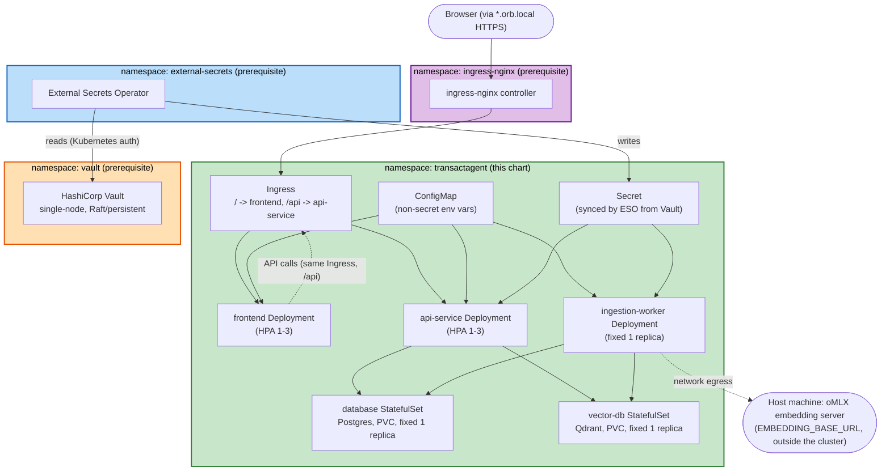

# Deployment Architecture — Kubernetes Deployment Support

## Overall Topology

## Traffic Flow
1. Browser resolves `transactagent.k8s.orb.local` (or the configured Ingress host) via OrbStack's automatic local-domain HTTPS — no public DNS/cert-manager involved (C3=A).
2. `ingress-nginx` routes `/` to the `frontend` Service, `/api` to the `api-service` Service — both `ClusterIP`, internal-only.
3. `frontend`'s runtime config (`API_BASE_URL`, via the existing override mechanism in `config.ts`) points at the same Ingress host's `/api` path, so browser-originated API calls also flow back through the same Ingress — no direct pod-to-pod exposure needed for the frontend↔api-service link from the browser's perspective.
4. `api-service` and `ingestion-worker` reach `database`/`vector-db` directly via their `ClusterIP` Services (standard in-cluster DNS, `database.transactagent.svc.cluster.local` etc.) — `NetworkPolicy` on both restricts this to same-namespace traffic only.
5. `ingestion-worker` reaches the host-only oMLX server via ordinary cluster egress (FR-K8S-11) — no Kubernetes-side change needed; behaves exactly as it does under Docker Compose today, including graceful degradation if unreachable.

## Secret Flow
1. (One-time, manual, outside this session) Whoever deploys installs Vault + ESO + ingress-nginx per `deploy/helm/prerequisites/README.md`, initializes and unseals Vault, and creates the Kubernetes-auth-backed `SecretStore` pointing ESO at Vault.
2. (One-time per environment) They run `deploy/scripts/populate-vault-secrets.sh`, which reads the project's `.env` file and writes each secret value into Vault under `secret/transactagent/*`.
3. `helm install` deploys this chart, which includes an `ExternalSecret` object referencing those Vault paths.
4. ESO syncs the referenced values into a native `Secret` object inside the `transactagent` namespace.
5. `api-service`/`ingestion-worker` pods consume that `Secret` via `envFrom` — from the application's point of view, this looks identical to today's `.env`-sourced environment variables; no application code changes.

## Shared Infrastructure Notes
- Four namespaces total: `transactagent` (this chart), `external-secrets`, `vault`, `ingress-nginx` — the latter three are cluster-shared prerequisites, installed once per cluster and reusable by other apps later, not owned by this chart.
- `docker-compose.yml` remains a fully independent, unaffected deployment path (FR-K8S-10) — this Kubernetes topology and the existing Docker Compose topology never interact.
- This document, `infrastructure-design.md`, `nfr-design-patterns.md`, and `logical-components.md` together are sufficient input for Code Generation — no unit-boundary ambiguity remains.
