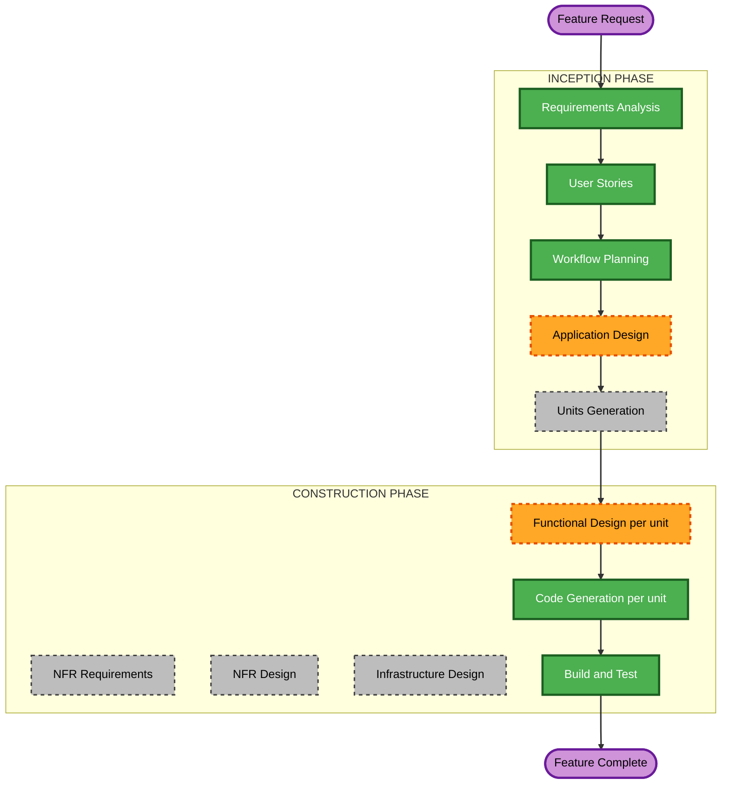

# Execution Plan — Account Balance at a Point in Time

Scoped to this feature only. The base project's own `execution-plan.md` and `aidlc-state.md` history are untouched; this plan governs the "Post-Completion Change" tracked separately in `aidlc-state.md`.

## Detailed Analysis Summary

### Transformation Scope (Brownfield)
- **Transformation Type**: Single-feature change within the existing architecture. No new container, no new external integration, no deployment-model change. The one-time backfill is a destructive data operation, not an architectural change.
- **Primary Changes**:
  - **Database**: new `Account` and balance-anchor entities, new `BankStatement` columns (account reference, account type, closing balance and its date), an additive migration.
  - **Ingestion Worker Service**: extraction schema and prompt extended to read an account identifier, account type, and printed closing balance; account resolution at ingestion; the reingest path the backfill relies on.
  - **API Service**: account management, anchor management, balance-at-date and balance-trend endpoints, an as-of-date FX lookup, discrepancy computation.
  - **Frontend SPA**: Dashboard balance section (lookup, chart, discrepancy warnings), account management and anchor entry UI.
- **Related Components**: All 4 existing units are touched; no 5th unit is introduced. The Model Training unit has no code change but is affected by the backfill's data wipe (see Risk Assessment).

### Change Impact Assessment
- **User-facing changes**: Yes. New Dashboard section, new account management and anchor entry UI, new ingestion outcomes the user must act on (confirm accounts, set anchors), and a one-time backfill the user triggers and reviews.
- **Structural changes**: No. `api-service` and `ingestion-worker` still coordinate only through the shared database.
- **Data model changes**: Yes. Two new entities, new columns on `bank_statements`, and a data migration path for existing rows (the backfill).
- **API changes**: Yes. New endpoints for accounts, anchors, balances, trend, and discrepancies. Extraction's internal contract (`RawExtractedStatement`) also changes, with new optional fields.
- **NFR impact**: Moderate. Exact decimal arithmetic (NFR-AB-1), destructive-operation safety (NFR-AB-2), extraction regression safety (NFR-AB-3), and query speed at current volume (NFR-AB-5) are specific enough to carry straight into Functional Design. No new security, scalability, or monitoring category.

### Component Relationships
- **Primary components**: `database`, `ingestion-worker` (Statement Extraction, Ingestion Orchestrator, Duplicate Detection), `api-service` (new account/balance components, Dashboard/Insights), `frontend` (Dashboard page).
- **Dependency order**: `ingestion-worker` and `api-service` both read and write the new tables but never call each other directly (same DB-only coordination as today). Both depend only on `database`. `frontend` depends only on `api-service`'s new endpoints.
- **Supporting components**: FX rate cache (existing `fx_rate_cache`, read by `api-service` for the as-of-date lookup); the nightly backup (existing) is not the pre-wipe backup mechanism, which Functional Design defines.
- **Unaffected by code, affected by data**: `model-training`'s Dataset Curator selects transactions by `category_source = manual`, or `similarity` with an approved proposal. The backfill preserves manual corrections (FR-AB-16) but discards proposals (FR-AB-17), so previously approved-similarity examples will no longer be eligible for a future training export. The classifier is currently shelved, so no live impact, but it is an accepted consequence to remember.

| Component | Change Type | Reason | Priority |
|---|---|---|---|
| Database | Major (new entities + columns) | Everything else depends on the new schema | Critical |
| Ingestion Worker Service | Major (extraction contract + account resolution) | Source of accounts, account types, and closing balances | Critical |
| API Service | Major (new components + endpoints) | Balance computation, anchors, accounts | Critical |
| Frontend SPA | Major (new Dashboard section + management UI) | User-facing surface | Important |
| Model Training | None (code) | Data-only impact, noted above | Optional |

### Risk Assessment
- **Risk Level**: High. The change touches all 4 units, alters an extraction contract used by every future ingestion, and includes a destructive wipe-and-reingest of live production data (about 6,000 transactions with manual corrections that cannot be regenerated).
- **Rollback Complexity**: Moderate for the additive parts (new tables and columns, new endpoints, new UI). Difficult for the backfill, which is not reversible in place. NFR-AB-2's verified backup, dry-run report, and explicit confirmation exist precisely so that the one irreversible step is gated.
- **Testing Complexity**: Complex. The balance function needs property-based tests (NFR-AB-4), the correction-preservation matching is a data-integrity risk needing explicit unit tests (including the unmatched case), and the extraction change needs a regression check against real statements, not just synthetic ones (NFR-AB-3).
- **Key mitigations built into the plan**:
  - Code Generation delivers the backfill tool; **running it against live data is a separate, explicitly confirmed step**, never part of a deploy or a test run (NFR-AB-2).
  - Build and Test live-verifies the new extraction against real statements and the balance computation against real data, using non-destructive checks (for example rolled-back transactions, as earlier features did) before any wipe is proposed.
  - Implementation happens on a feature branch with a PR, per the established git workflow; nothing is committed directly to `main`.

## Workflow Visualization



### Text Alternative
```
INCEPTION
- Requirements Analysis: COMPLETED
- User Stories: COMPLETED
- Workflow Planning: IN PROGRESS (this document)
- Application Design: EXECUTE
- Units Generation: SKIP (existing 4 units already decomposed; this feature maps onto them, no new unit boundary needed)

CONSTRUCTION (per affected unit: Database, Ingestion Worker Service, API Service, Frontend SPA)
- Functional Design: EXECUTE (new data model + new business rules per unit)
- NFR Requirements: SKIP (NFR-AB-1..8 are specific enough to carry straight into Functional Design)
- NFR Design: SKIP (follows NFR Requirements)
- Infrastructure Design: SKIP (no new container, port, or topology; revisit only if Functional Design places the backfill in a new runtime path)
- Code Generation: EXECUTE (always)
- Build and Test: EXECUTE (always, after all 4 units)
```

## Phases to Execute

### INCEPTION PHASE
- [x] Requirements Analysis (COMPLETED)
- [x] User Stories (COMPLETED)
- [x] Workflow Planning (IN PROGRESS: this document)
- [ ] Application Design: **EXECUTE**
  - **Rationale**: New components and cross-unit dependencies need explicit definition before per-unit Functional Design: an Account Resolver and extended Statement Extraction in `ingestion-worker`; Account Management, Anchor Management, a Balance Calculator, FX as-of-date lookup, and a Discrepancy Checker in `api-service`; the Dashboard balance section and account management UI in `frontend`; and the backfill tool, whose home (script, endpoint, or CLI) is an open item in the requirements.
- [ ] Units Generation: **SKIP**
  - **Rationale**: The 4 units already exist and were decomposed during the original build. This feature adds behavior within those boundaries; no new unit and no re-decomposition.

### CONSTRUCTION PHASE (repeated per affected unit: Database, Ingestion Worker Service, API Service, Frontend SPA)
- [ ] Functional Design: **EXECUTE**
  - **Rationale**: New data model (Database), new extraction fields plus account-resolution rules (Ingestion Worker), balance and cross-check business logic, FX as-of-date handling, endpoints and DTOs (API Service), new section and management UI structure (Frontend). Also the right place to resolve the open items carried from the requirements: chart granularity, FX fallback for a date with no rate, backfill mechanism and backup location, cross-check tolerance, identifier storage shape.
- [ ] NFR Requirements: **SKIP**
  - **Rationale**: NFR-AB-1 (exact arithmetic), NFR-AB-2 (destructive-operation safety), NFR-AB-3 (extraction regression), NFR-AB-5 (speed at current volume), and the rest are already specific and testable in `account-balance-requirements.md`; no new technology selection is needed. They carry straight into Functional Design as constraints.
- [ ] NFR Design: **SKIP**
  - **Rationale**: Follows NFR Requirements being skipped.
- [ ] Infrastructure Design: **SKIP**
  - **Rationale**: No new container, host port, or deployment topology change; everything lives in the 4 existing services. To be revisited only if Functional Design decides the backfill needs a runtime path that doesn't exist today (for example a database dump tool inside a container image).
- [ ] Code Generation: **EXECUTE (ALWAYS)**
  - **Rationale**: Implementation is the point of this change.
- [ ] Build and Test: **EXECUTE (ALWAYS)**
  - **Rationale**: This project's established completion bar is live-container verification, not just unit tests. Here that includes verifying the new extraction against real statements and the balance computation against real data without wiping anything; the actual wipe-and-reingest against live data is a separate, explicitly confirmed step.

### OPERATIONS PHASE
- [ ] Operations: PLACEHOLDER
  - **Rationale**: Future deployment and monitoring workflows; all build, test, and deploy activity is handled in Construction for this project.

## Package Change Sequence

1. **Database**: add the `Account` and anchor tables and the new `bank_statements` columns via an additive migration. Must land first; both other backend units depend on it.
2. **Ingestion Worker Service** and **API Service**: can proceed in parallel once Database is ready. They coordinate only through the new tables; neither calls the other directly.
3. **Frontend SPA**: depends on `api-service`'s new endpoints; naturally last.
4. **Backfill execution (live data)**: after all four units are built, tested, and deployed, and only with the user's explicit confirmation. It is deliberately outside the unit sequence above because it is an operation on data, not a code change.

## Success Criteria
- **Primary Goal**: The Account Owner can look up the SGD balance of each savings account, and a combined total, for any date or month on the Dashboard, see a balance-over-time chart, and be warned when a statement's printed closing balance disagrees with the computed balance.
- **Key Deliverables**: Additive migration (accounts, anchors, statement columns); extended extraction and account resolution; account, anchor, and balance endpoints; Dashboard balance section and account management UI; a safety-gated backfill tool with dry-run, backup check, correction re-apply, and completion report.
- **Quality Gates**:
  - All 4 units' existing test suites still pass; new tests cover US-13.1 to US-13.7's acceptance criteria.
  - Property-based tests on the pure balance function (NFR-AB-4).
  - Extraction regression check against real statements (NFR-AB-3).
  - Full stack rebuilt and verified live, matching this project's established bar.
  - No wipe of live data occurs without the verified backup, dry-run report, and explicit confirmation from NFR-AB-2.
