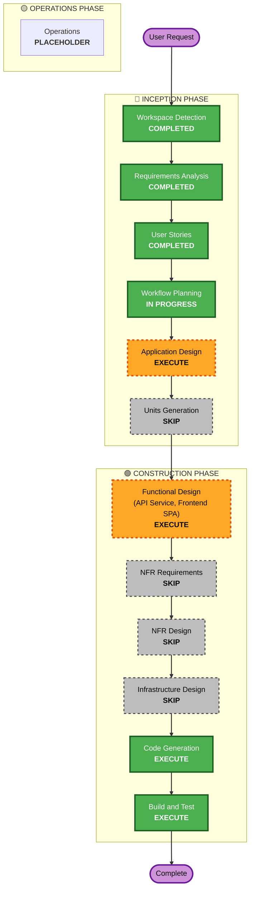

# Execution Plan — Background Process Visibility

## Detailed Analysis Summary

### Change Impact Assessment
- **User-facing changes**: Yes — new persistent nav bar indicator + detail panel, visible on every page.
- **Structural changes**: No — no new component/service boundary; extends existing API Service and Frontend SPA.
- **Data model changes**: No — reads existing `IngestionRun`/`RecategorizationJob` rows only, per FR-BPV-6/NFR-BPV-5. No migration.
- **API changes**: Yes — one new read-only endpoint (status + recent history), separate from the existing `restart-guidance` endpoint.
- **NFR impact**: Minor — new polling cadence (a few seconds), reusing the existing `useQuery`/`refetchInterval` pattern already in `NavBar.tsx`. No new library, no new infrastructure, no new docker-compose service.

### Component Relationships
- **Primary Components**: API Service (new endpoint/business logic), Frontend SPA (new NavBar indicator + detail panel).
- **Unaffected**: Database (no schema change), Ingestion Worker Service (already writes the `status`/`completed_at` columns this feature reads — no worker code changes needed).

### Risk Assessment
- **Risk Level**: Low — read-only feature, no schema change, no write-path changes, easy rollback (revert 2 units' changes).
- **Rollback Complexity**: Easy
- **Testing Complexity**: Simple — mostly polling/display logic with existing precedent (`PendingReviewBadge`, `RecurringPaymentsBadge`, `is_ingestion_worker_busy`).

## Workflow Visualization

## Phases to Execute

### 🔵 INCEPTION PHASE
- [x] Workspace Detection (COMPLETED)
- [x] Requirements Analysis (COMPLETED)
- [x] User Stories (COMPLETED — Epic 11, 3 stories)
- [x] Workflow Planning (IN PROGRESS — this document)
- [ ] Application Design — **EXECUTE**
  - **Rationale**: A new API endpoint's business logic (what counts as "recent," which fields to expose, response shape) needs definition, and the Frontend gains two new components (nav bar indicator + detail panel) whose interaction needs specifying before Code Generation.
- [ ] Units Generation — **SKIP**
  - **Rationale**: Reuses all 4 existing units (Database, API Service, Ingestion Worker Service, Frontend SPA). No new unit needed.

### 🟢 CONSTRUCTION PHASE
Per-unit stages — only API Service and Frontend SPA are affected. Database and Ingestion Worker Service need no changes (the two in-scope job types already write the status/timestamp columns this feature reads).

- [ ] Functional Design — **EXECUTE** (API Service, Frontend SPA only)
  - **Rationale**: New endpoint's business rules (recent-history window/count, response DTO shape) and new frontend component behavior (running/idle/history states, polling) both need definition before code.
- [ ] NFR Requirements — **SKIP**
  - **Rationale**: No new library, no new performance/security/scalability concern beyond reusing the existing `useQuery`/`refetchInterval` polling pattern already established in this codebase.
- [ ] NFR Design — **SKIP**
  - **Rationale**: Follows from NFR Requirements SKIP above.
- [ ] Infrastructure Design — **SKIP**
  - **Rationale**: No new docker-compose service, no new port, no new environment variable, no new external dependency.
- [ ] Code Generation — **EXECUTE (ALWAYS)**
  - **Rationale**: Implementation needed for the new endpoint (API Service) and new components (Frontend SPA).
- [ ] Build and Test — **EXECUTE (ALWAYS)**
  - **Rationale**: Verification needed before considering the feature complete, per project precedent.

### 🟡 OPERATIONS PHASE
- [ ] Operations — PLACEHOLDER

## Unit Update Sequence
1. **API Service** — new endpoint must exist before the Frontend can consume it.
2. **Frontend SPA** — nav bar indicator + detail panel, consuming the new endpoint.

Database and Ingestion Worker Service: no changes required for this feature.

## Success Criteria
- **Primary Goal**: A user can tell, from any page, whether an ingestion run or recategorization job is currently active, and glance at recent completions without navigating away.
- **Key Deliverables**: New API endpoint; new NavBar indicator component; new detail panel; 0 new database migrations.
- **Quality Gates**: All new/existing unit tests passing across API Service and Frontend SPA; live verification against the running stack per this project's established Build and Test precedent.
