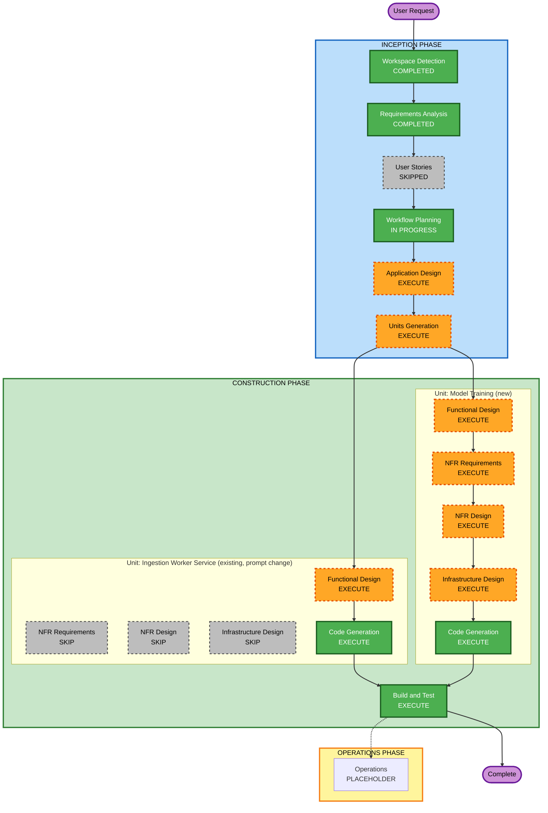

# Execution Plan: Categorization Model Fine-Tuning

## Detailed Analysis Summary

### Change Impact Assessment
- **User-facing changes**: No — this is an offline ML tooling feature. The one exception (FR-CFT-9) changes what text is sent to the LLM during categorization, but produces no UI/API contract change.
- **Structural changes**: Yes — a new, architecturally distinct unit (`model-training/`) is added: its own Python environment (mlx-tune, ClearML), no docker-compose service, runs standalone on the host, reads the database read-only.
- **Data model changes**: No new tables/columns. Dataset curation reads existing `transactions`/`recategorization_proposals`/`categorization_disagreements` data as-is.
- **API changes**: No new/changed API endpoints.
- **NFR impact**: Yes — new external dependency (ClearML SaaS), new heavyweight ML dependency set isolated from the existing 4 units, a real infra question (Postgres currently has no host port mapped — `docker compose ps` shows no published port for `transactagent-db` — so a host-run script needs a deliberate access decision).

### Component Relationships
- **Primary component (new)**: Model Training unit — dataset curation script + training script + evaluation script, all standalone CLI, reading the DB read-only.
- **Secondary component (existing, modified)**: Ingestion Worker Service's Categorization Engine (`llm_classifier.py`/`openrouter_client.py`/`categorization/service.py`) — FR-CFT-9's live prompt enrichment.
- **Dependent components**: None call into Model Training; it's a leaf/offline component.
- **Supporting**: ClearML SaaS (external, new).

### Risk Assessment
- **Risk Level**: Medium — new tech stack and a real DB-access infra decision, but each piece is well-isolated (no impact on the running web stack beyond one small prompt change) and there's no automated deployment path back into production to get wrong.
- **Rollback Complexity**: Easy for Model Training (standalone, nothing to roll back in production). Moderate for the Ingestion Worker prompt change (a normal code revert + redeploy, same as any other unit change this project has already done many times).
- **Testing Complexity**: Moderate — dataset curation query logic is testable normally; the training/evaluation pipeline itself is inherently harder to unit-test (real model, real MLX runtime) and will lean on live verification (this project's established pattern) more than pure unit tests.

## Workflow Visualization

## Phases to Execute

### INCEPTION PHASE
- [x] Workspace Detection (COMPLETED)
- [x] Requirements Analysis (COMPLETED & APPROVED)
- [x] User Stories (SKIPPED — developer/ML tooling, no user-facing functionality)
- [x] Workflow Planning (this document)
- [ ] Application Design — **EXECUTE**
  - **Rationale**: A genuinely new logical component (Model Training) is being introduced, with its own responsibilities (curation, training, evaluation) and a dependency (read-only) on the existing Database — needs the same component/dependency documentation treatment every prior unit got in `components.md`/`component-dependency.md`.
- [ ] Units Generation — **EXECUTE**
  - **Rationale**: `model-training/` is architecturally distinct from the 4 existing units — its own Python environment/dependency set, no docker-compose service, different lifecycle (manual/offline vs. always-on). It doesn't fit inside any existing unit's boundary, so it needs to be formally established as a new unit (Unit 5).

### CONSTRUCTION PHASE

**Unit: Ingestion Worker Service** (existing unit, scoped change — FR-CFT-9 only)
- [ ] Functional Design — **EXECUTE**
  - **Rationale**: The categorization prompt's business logic changes (adding `converted_amount_sgd`) — needs a business-rules addendum like every prior change to this unit.
- [ ] NFR Requirements — **SKIP**
  - **Rationale**: No new tech stack for this unit; existing FastAPI/SQLAlchemy/OpenRouter-client stack already covers this change.
- [ ] NFR Design — **SKIP**
  - **Rationale**: No new NFR patterns needed for a prompt-text change.
- [ ] Infrastructure Design — **SKIP**
  - **Rationale**: No new infrastructure; same container, same deployment.
- [ ] Code Generation — **EXECUTE (ALWAYS)**

**Unit: Model Training** (new unit)
- [ ] Functional Design — **EXECUTE**
  - **Rationale**: New business logic to define precisely — the curation SQL/criteria (FR-CFT-1), dataset export shape (FR-CFT-2..4), training flow (FR-CFT-5..6), and evaluation flow (FR-CFT-7).
- [ ] NFR Requirements — **EXECUTE**
  - **Rationale**: A brand-new tech stack for this project (mlx-tune, ClearML client, HuggingFace download tooling, Python env/dependency management for a non-containerized component) needs the same tech-stack selection treatment every other unit got at project start.
- [ ] NFR Design — **EXECUTE**
  - **Rationale**: Follows from NFR Requirements — incorporating patterns for read-only DB access, credential handling (ClearML), and reproducibility (NFR-CFT-4).
- [ ] Infrastructure Design — **EXECUTE**
  - **Rationale**: A real, unresolved infra question exists — the live Postgres container currently has **no host port published** (confirmed via `docker compose ps`; only `api-service` on 7878 and `frontend` on 8787 are exposed). A host-run script needs a deliberate decision: publish a DB port, or run the training scripts inside a throwaway container attached to the existing docker network. This is exactly what Infrastructure Design exists to resolve.
- [ ] Code Generation — **EXECUTE (ALWAYS)**

### Build and Test (after both units)
- [ ] Build and Test — **EXECUTE (ALWAYS)**
  - **Rationale**: Dataset curation logic gets test coverage per NFR-CFT-6; the Ingestion Worker prompt change gets verified against the live stack per this project's established practice; a full training run is executed at least once end-to-end (small-scale smoke run) to confirm the pipeline actually works, consistent with this project's "verified against live containers, not just green tests" standard.

### OPERATIONS PHASE
- [ ] Operations — PLACEHOLDER

## Recommended Unit Build Sequence
1. **Ingestion Worker Service** (prompt enrichment) first — so the "current live model" the evaluation step (FR-CFT-7b) compares against already reflects the post-change prompt shape, keeping the A/B comparison meaningful.
2. **Model Training** (new unit) second — dataset curation, training, evaluation.

## Success Criteria
- **Primary Goal**: A working, manually-triggered pipeline that curates a trustworthy training dataset from labeled transactions and fine-tunes the categorization model via mlx-tune, with runs tracked in ClearML.
- **Key Deliverables**: `model-training/` codebase (curation + training + evaluation scripts); updated live categorization prompt including amount; a completed smoke-test fine-tuning run with evaluation results logged to ClearML.
- **Quality Gates**: Dataset curation query logic covered by tests; Ingestion Worker Service's existing test suite stays green after the prompt change; at least one real end-to-end training run completed and verified (not just code that theoretically runs).
