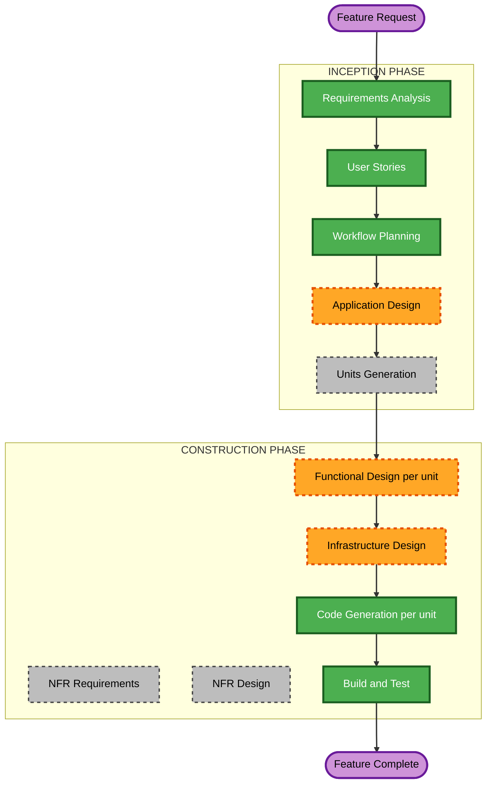

# Execution Plan — Configurable Application Settings

Scoped to this feature only. The base project's own `execution-plan.md` and `aidlc-state.md` history are untouched; this plan governs the "Post-Completion Change" tracked separately in `aidlc-state.md`.

## Detailed Analysis Summary

### Transformation Scope (Brownfield)
- **Transformation Type**: Single-feature addition within the existing architecture — no new deployable container, no new external integration, no deployment-model change. Introduces one new cross-service coordination mechanism that didn't exist before: a shared, file-backed settings-override + worker-status channel between `ingestion-worker` and `api-service`.
- **Primary Changes**: A new settings-override read/write + validation + allow-list-enforcement module (API Service); a change to how both `Settings` classes load configuration (`env_file` support, Ingestion Worker + API Service `config.py`); a new busy/idle status signal written by `ingestion-worker`'s poll loop and read by `api-service`; a new persisted change-history entity (Database); a new "Application Settings" section on the existing Settings page (Frontend); `docker-compose.yml` changes (close the existing env-mapping gap for the 35 exposed settings, add the shared volume, avoid the process-env-vs-`env_file`-precedence conflict).
- **Related Components**: All 4 existing units are touched; no 5th unit/container is introduced (Resolved Decision 2 explicitly ruled out a Docker-socket-holding sidecar).

### Change Impact Assessment
- **User-facing changes**: Yes — an entirely new Settings-page section (edit, validate, confirm, restart guidance, busy/idle indicator, change history) per Epic 10.
- **Structural changes**: Yes, but narrow — a new shared Docker volume between `ingestion-worker` and `api-service` (for the override file + a busy/idle status file) is a genuinely new inter-service coordination path; no new service/container.
- **Data model changes**: Yes — a new change-history entity (Database).
- **API changes**: Yes — new `api-service` endpoints for listing/reading/writing settings, reading worker busy/idle status, and viewing change history.
- **NFR impact**: Real but already fully specified — NFR-CAS-1..6 in the requirements doc (no Docker-socket/automation, server-side allow-list enforcement, override file git-ignored, validation-rules-from-`config.py`-single-source, heartbeat-derived real status, DB-persisted history) are concrete enough to carry straight into Application/Functional Design without a dedicated NFR stage.

### Component Relationships
- **Primary components**: `api-service` (new settings module: allow-list, validation, override-file write, restart guidance, busy/idle read, change-history read/write), `ingestion-worker` (config-loading mechanism change, busy/idle status writing), `database` (new change-history entity), `frontend` (new Settings-page section).
- **Dependency order**: `database` first (both backend services read/write the change-history table). `ingestion-worker` and `api-service` then coordinate through two channels — the database (as always) AND, newly, a shared file-backed volume (override file + busy/idle status) — so both need the volume's shape agreed before either is code-generated; sequenced together as before. `frontend` depends on `api-service`'s new endpoints, so it's last.
- **Supporting components**: None new (no 5th container).

### Risk Assessment
- **Risk Level**: Medium-High — this is the first feature in the project with a real security boundary that must hold under adversarial-shaped requests (secrets must never become reachable through the new API surface, enforced server-side per NFR-CAS-2, not just hidden in the UI) and the first cross-service coordination path that isn't purely through the database. Every other aspect (no new container, no new external dependency, no automation/Docker-socket) keeps the blast radius contained.
- **Rollback Complexity**: Moderate — additive schema, additive endpoints, additive UI section; the override-file/`env_file` change to both `Settings` classes is the one piece that touches existing config-loading behavior and needs care to avoid regressing any currently-working setting.
- **Testing Complexity**: Moderate-High — the allow-list/exclusion boundary needs explicit negative-path tests (a request naming an excluded field must be rejected), the validation-per-field-constraint logic needs coverage per field type, and the busy/idle gating needs both-state coverage, per NFR-CAS-2/NFR-CAS-4/NFR-CAS-5 and Epic 10's stories.

## Workflow Visualization



### Text Alternative
```
INCEPTION
- Requirements Analysis: COMPLETED
- User Stories: COMPLETED (Epic 10, 4 stories)
- Workflow Planning: IN PROGRESS (this document)
- Application Design: EXECUTE
- Units Generation: SKIP (existing 4 units already decomposed; this feature maps onto them)

CONSTRUCTION (per affected unit: Database, Ingestion Worker Service, API Service, Frontend SPA)
- Functional Design: EXECUTE (all 4 units — new data shape, new settings module + business rules, config-loading + status-writing change, new UI section)
- NFR Requirements: SKIP (NFR-CAS-1..6 already concrete enough to carry directly into Application/Functional Design)
- NFR Design: SKIP (same reason)
- Infrastructure Design: EXECUTE (Ingestion Worker Service unit, but covers docker-compose.yml holistically) — new shared volume, env-mapping gap closure, precedence fix, .env.example/gitignore updates
- Code Generation: EXECUTE (always)
- Build and Test: EXECUTE (always, after all affected units)
```

## Phases to Execute

### INCEPTION PHASE
- [x] Requirements Analysis (COMPLETED)
- [x] User Stories (COMPLETED — Epic 10)
- [x] Workflow Planning (IN PROGRESS — this document)
- [ ] Application Design — **EXECUTE**
  - **Rationale**: A genuinely new component (the settings module: allow-list, validation, write, restart guidance, busy/idle read, history) needs its methods and business rules defined; the shared-volume contract between `ingestion-worker` and `api-service` needs to be agreed once, centrally, before either unit's Functional Design proceeds independently — otherwise the two units could design incompatible file formats.
- [ ] Units Generation — **SKIP**
  - **Rationale**: The 4 units already exist; this feature changes behavior and adds endpoints/UI within those existing boundaries — no new unit.

### CONSTRUCTION PHASE (repeated per affected unit: Database, Ingestion Worker Service, API Service, Frontend SPA)
- [ ] Functional Design — **EXECUTE**
  - **Rationale**: New entity + lifecycle (Database); config-loading mechanism change + busy/idle status writing + business rules for what "idle" means (Ingestion Worker); new settings module's business rules — allow-list enforcement, per-field validation source, write ordering, restart-guidance construction (API Service); new UI section's component structure and state flow (Frontend).
- [ ] NFR Requirements — **SKIP**
  - **Rationale**: No new performance/security/scalability *category* — NFR-CAS-1..6 are already specific and are implemented directly as part of Functional Design and Code Generation, same precedent as Recategorization Review and Matching Precision Refinement.
- [ ] NFR Design — **SKIP**
  - **Rationale**: Same as above — nothing to design against since NFR Requirements is skipped.
- [ ] Infrastructure Design — **EXECUTE** (tracked under Ingestion Worker Service unit, since that's this project's established location for `docker-compose.yml`-level changes, but the changes here span both `ingestion-worker` and `api-service`'s compose blocks together)
  - **Rationale**: A real, new piece of infrastructure is needed — a shared volume for the override file + busy/idle status — plus closing the pre-existing env-mapping gap (Current Behavior in the requirements doc) and resolving the process-env-vs-`env_file` precedence conflict (FR-CAS-5) so the override mechanism actually works. This is infrastructure-topology work, not application logic, matching the precedent set by Epic 9's Infrastructure Design (new `vector-db` service + env vars).
- [ ] Code Generation — **EXECUTE (ALWAYS)**
  - **Rationale**: Implementation is the point of this change.
- [ ] Build and Test — **EXECUTE (ALWAYS)**
  - **Rationale**: This project's established completion bar is live-container verification, not just unit tests (per `audit.md` precedent across every prior feature) — especially important here given the new shared-volume mechanism needs to be proven working against real running containers, not just mocked.

## Package Change Sequence

1. **Database** — land the change-history entity/migration. Must land first; `api-service` depends on it to write history entries.
2. **Ingestion Worker Service** and **API Service** — proceed together once Database is ready and the Application Design stage has fixed the shared-volume file format (override-settings file shape, busy/idle status file shape). Neither calls the other directly — they coordinate through the database (as every prior feature) and, newly, through the shared volume.
3. **Frontend SPA** — depends on API Service's new endpoints; naturally last.

## Success Criteria
- **Primary Goal**: The Account Owner can view and edit the 35 in-scope settings from the Settings page, with server-side validation, an explicit confirmation step, a written non-secret override file, clear manual-restart guidance (gated by live busy/idle status for Ingestion-Worker-owned settings), and a persisted, viewable change history — with zero path by which a secret/credential setting becomes reachable through the new surface.
- **Key Deliverables**: New change-history entity + migration; updated `config.py` loading mechanism in both backend services; new `api-service` settings module + endpoints; new shared Docker volume + `docker-compose.yml` fixes; new Frontend "Application Settings" section; tests for every FR-CAS/NFR-CAS branch, including the exclusion-boundary negative path.
- **Quality Gates**: All 4 units' existing test suites still pass; new tests cover Epic 10's acceptance criteria; full stack rebuilt and verified live (matching this project's established bar) — including actually editing a setting, restarting the real container, and confirming the new value took effect.
