# Execution Plan — Dark Mode (GitHub Issue #1)

## Detailed Analysis Summary

### Change Impact Assessment
- **User-facing changes**: Yes — new NavBar toggle, and every existing page/component gains a second visual mode.
- **Structural changes**: No — no new backend component, service, or business-logic layer. A client-side `ThemeContext`/toggle plus Tailwind `dark:` styling is an implementation detail within the existing Frontend SPA unit, not a new architectural component.
- **Data model changes**: No.
- **API changes**: No — Frontend-only, no Database/API Service/Ingestion Worker Service involvement.
- **NFR impact**: Yes, but scoped entirely to the existing Frontend SPA's presentation layer (contrast/accessibility per NFR-DM-2) — no new tech stack, no new logical component, no infrastructure change.

### Component Relationships (Brownfield)
- **Primary Component**: Frontend SPA (only unit affected)
- **Infrastructure Components**: None — no `docker-compose.yml`/build changes needed beyond the existing frontend build
- **Shared Components**: None — Tailwind config (`tailwind.config.js`) gains `darkMode: 'class'`, a project-wide but purely additive config change
- **Dependent Components**: None — Database, API Service, Ingestion Worker Service are all unaffected
- **Supporting Components**: None

### Risk Assessment
- **Risk Level**: Low-Medium — no data/backend risk at all (pure presentation), but the change touches every page and inline sub-component, so consistency (not missing a spot) is the main risk, not correctness of business logic.
- **Rollback Complexity**: Easy — a single frontend-only change set, revertible independently of all other units.
- **Testing Complexity**: Moderate — broad manual/visual verification surface (7 pages + charts + all inline components in both modes), but the toggle/persistence logic itself is simple and unit-testable.

## Workflow Visualization

```mermaid
flowchart TD
    Start(["User Request: Dark Mode (Issue #1)"])

    subgraph INCEPTION["🔵 INCEPTION PHASE"]
        WD["Workspace Detection<br/><b>COMPLETED</b>"]
        RA["Requirements Analysis<br/><b>COMPLETED</b>"]
        US["User Stories<br/><b>COMPLETED</b>"]
        WP["Workflow Planning<br/><b>IN PROGRESS</b>"]
        AD["Application Design<br/><b>SKIP</b>"]
        UG["Units Generation<br/><b>SKIP</b>"]
    end

    subgraph CONSTRUCTION["🟢 CONSTRUCTION PHASE (Frontend SPA only)"]
        FD["Functional Design<br/><b>SKIP</b>"]
        NFRA["NFR Requirements<br/><b>SKIP</b>"]
        NFRD["NFR Design<br/><b>SKIP</b>"]
        ID["Infrastructure Design<br/><b>SKIP</b>"]
        CG["Code Generation<br/><b>EXECUTE</b>"]
        BT["Build and Test<br/><b>EXECUTE</b>"]
    end

    subgraph OPERATIONS["🟡 OPERATIONS PHASE"]
        OPS["Operations<br/><b>PLACEHOLDER</b>"]
    end

    Start --> WD
    WD --> RA
    RA --> US
    US --> WP
    WP --> AD
    AD --> UG
    UG --> FD
    FD --> NFRA
    NFRA --> NFRD
    NFRD --> ID
    ID --> CG
    CG --> BT
    BT -.-> OPS
    BT --> End(["Complete"])

    style WD fill:#4CAF50,stroke:#1B5E20,stroke-width:3px,color:#fff
    style RA fill:#4CAF50,stroke:#1B5E20,stroke-width:3px,color:#fff
    style US fill:#4CAF50,stroke:#1B5E20,stroke-width:3px,color:#fff
    style WP fill:#4CAF50,stroke:#1B5E20,stroke-width:3px,color:#fff
    style CG fill:#4CAF50,stroke:#1B5E20,stroke-width:3px,color:#fff
    style BT fill:#4CAF50,stroke:#1B5E20,stroke-width:3px,color:#fff
    style OPS fill:#BDBDBD,stroke:#424242,stroke-width:2px,stroke-dasharray: 5 5,color:#000
    style AD fill:#BDBDBD,stroke:#424242,stroke-width:2px,stroke-dasharray: 5 5,color:#000
    style UG fill:#BDBDBD,stroke:#424242,stroke-width:2px,stroke-dasharray: 5 5,color:#000
    style FD fill:#BDBDBD,stroke:#424242,stroke-width:2px,stroke-dasharray: 5 5,color:#000
    style NFRA fill:#BDBDBD,stroke:#424242,stroke-width:2px,stroke-dasharray: 5 5,color:#000
    style NFRD fill:#BDBDBD,stroke:#424242,stroke-width:2px,stroke-dasharray: 5 5,color:#000
    style ID fill:#BDBDBD,stroke:#424242,stroke-width:2px,stroke-dasharray: 5 5,color:#000
    style INCEPTION fill:#BBDEFB,stroke:#1565C0,stroke-width:3px,color:#000
    style CONSTRUCTION fill:#C8E6C9,stroke:#2E7D32,stroke-width:3px,color:#000
    style OPERATIONS fill:#FFF59D,stroke:#F57F17,stroke-width:3px,color:#000
    style Start fill:#CE93D8,stroke:#6A1B9A,stroke-width:3px,color:#000
    style End fill:#CE93D8,stroke:#6A1B9A,stroke-width:3px,color:#000

    linkStyle default stroke:#333,stroke-width:2px
```

## Phases to Execute

### 🔵 INCEPTION PHASE
- [x] Workspace Detection (COMPLETED)
- [x] Requirements Analysis (COMPLETED — `dark-mode-requirements.md`)
- [x] User Stories (COMPLETED — `dark-mode-stories.md`, Epic 12)
- [x] Workflow Planning (IN PROGRESS — this document)
- [ ] Application Design — **SKIP**
  - **Rationale**: No new component, service, or component-method signature is needed. The theme toggle is client-side UI state (a React context + `localStorage`), not a new architectural layer — matches the precedent of Recategorization Scope Narrowing and Similarity-Matching Normalization, both single-unit changes with no new component.
- [ ] Units Generation — **SKIP**
  - **Rationale**: Reuses the existing Frontend SPA unit; no new unit needed.

### 🟢 CONSTRUCTION PHASE (Frontend SPA unit only — Database/API Service/Ingestion Worker Service unaffected)
- [ ] Functional Design — **SKIP**
  - **Rationale**: No new data model, no business rules to design. The behavior (OS-preference default, manual override precedence, persistence, cross-tab sync) is already fully specified as testable acceptance criteria in `dark-mode-stories.md` US-12.1–12.3 — a separate Functional Design pass would just restate them.
- [ ] NFR Requirements — **SKIP**
  - **Rationale**: No new tech stack or library choice needed; extends the existing Tailwind/React stack per NFR-DM-4.
- [ ] NFR Design — **SKIP**
  - **Rationale**: No new logical component or resiliency/performance pattern; NFR-DM-2 (contrast) and NFR-DM-3 (no-flash) are direct implementation concerns handled during Code Generation, not architectural patterns.
- [ ] Infrastructure Design — **SKIP**
  - **Rationale**: No infrastructure change — same frontend container/build, no new service, no new port, no new volume.
- [ ] Code Generation — **EXECUTE (ALWAYS)**
  - **Rationale**: `tailwind.config.js` (`darkMode: 'class'`), new `ThemeContext`/toggle, NavBar control, and a `dark:` styling pass across all 7 pages + inline sub-components + Chart.js theming.
- [ ] Build and Test — **EXECUTE (ALWAYS)**
  - **Rationale**: Unit tests for the toggle/persistence logic, `tsc`/`vite build`/lint clean, and live visual verification of both modes across the app per NFR-DM-5 (no light-mode regression).

### 🟡 OPERATIONS PHASE
- [ ] Operations — **PLACEHOLDER** (deployment is `docker compose build frontend && up -d`, already covered in Build and Test per project convention)

## Success Criteria
- **Primary Goal**: Ship a working, persisted, accessible Light/Dark toggle covering the entire Frontend SPA, closing GitHub issue #1.
- **Key Deliverables**: `ThemeContext` + NavBar toggle; `dark:` variants across NavBar, all 7 pages, all inline sub-components, and Chart.js theming; unit tests for toggle logic; `dark-mode-build-and-test-summary.md`.
- **Quality Gates**: `tsc -b` + `vite build` + existing test suite clean; live visual check of both modes on every page; WCAG AA contrast check on text/badges in dark mode; light mode pixel-equivalent to today.
