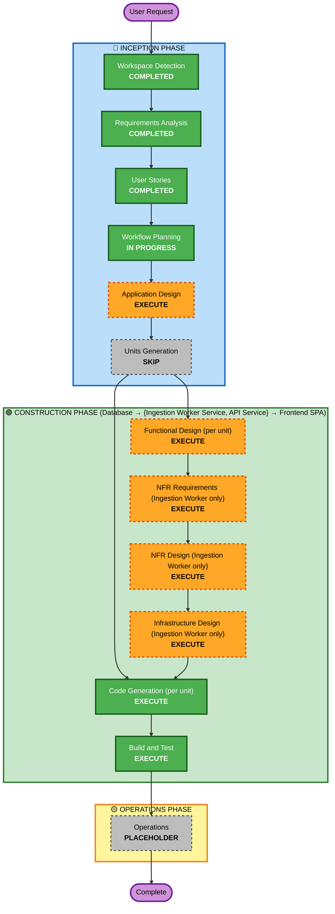

# Execution Plan — Local Embedding-Based Semantic Similarity

## Detailed Analysis Summary

### Transformation Scope
- **Type**: Multi-unit feature addition within the existing architecture — no new deployable unit (the local
  embedding runtime and the vector DB are infrastructure/tech-stack additions, not new AI-DLC units, same
  treatment as OpenRouter/Gemini today).
- **Primary Changes**: New Embedding component in the Ingestion Worker Service (calls the user-managed oMLX
  endpoint, writes to a new vector DB service), a one-time backfill job, extended Categorization Engine +
  Recurring Payment Manager + Detection Scan (embedding-first, existing fuzzy-text matcher as fallback), a
  new embedding-status field surfaced by the API Service, and a badge in the Frontend transaction list.
- **Related Components**: The existing fuzzy-text Similarity Matcher (`find_best_match`, WR-3/WR-20) is kept
  as the fallback, not removed — reused, not duplicated.

### Change Impact Assessment
- **User-facing changes**: Yes — the embedding-status badge (US-9.1) is new UI; categorization/matching
  accuracy changes are otherwise invisible to the Account Owner (US-9.2..9.5 describe outcomes, not new
  screens).
- **Structural changes**: No new unit; new component within the Ingestion Worker Service; new external
  dependency (oMLX, user-managed, out of `docker-compose`) and a new containerized dependency (vector DB).
- **Data model changes**: Yes — a new field (or two: status + a vector-store reference id) on `transactions`
  tracking embedding-computation state, read by the API Service for the badge.
- **API changes**: Yes — the existing transaction-list endpoint(s) need to expose the new embedding-status
  field.
- **NFR impact**: Yes — new tech-stack decisions (vector DB product; oMLX client config; backfill
  idempotency strategy), scoped to the Ingestion Worker Service.

### Component Relationships
- **Primary Component**: Ingestion Worker Service (new Embedding component + backfill job; extended
  Categorization Engine, Recurring Payment Manager, Detection Scan).
- **Secondary Components**: Database (new field(s) on `transactions`), API Service (expose the field),
  Frontend SPA (render the badge — depends on the API Service change).
- **Dependency chain**: Database's new field must exist before the Worker can write embedding-status, before
  the API can read it, before the Frontend can render it — same sequencing pattern as every prior epic.
- **External dependencies**: oMLX (user-managed, host-native, config-pointed — no `docker-compose` change);
  a new vector DB service (containerized, added to `docker-compose`, product TBD at NFR Requirements).

### Risk Assessment
- **Risk Level**: Medium-High — introduces a new external runtime dependency outside this project's own
  deployment automation, changes the decision order of already-working, safety-sensitive matching logic in
  three places, and includes a one-time backfill touching all existing transaction data (additive only —
  new field population, no destructive writes — but still a first for this project's "forward-only"
  precedent). Mitigated by NFR-1's explicit, non-negotiable carryover of the amount-gate protection
  (US-9.3) and FR-10's soft-fail behavior (US-9.4) keeping the whole feature strictly additive to existing
  functionality — nothing in today's matching behavior can get worse than before if any part of this fails.
- **Rollback Complexity**: Easy for the application code (additive; also isolated on branch
  `feature/recurring-payments-budget-alerts`, `main` unaffected). Moderate for the vector DB service
  (new container + persistent volume to remove on rollback) and for the backfilled data (a new field with
  populated values — harmless to leave in place even if the feature is later reverted).
- **Testing Complexity**: High — three call sites now share a new decision order, the amount-gate carryover
  needs explicit regression coverage (US-9.3), and embedding calls are I/O-bound/non-deterministic, unlike
  every prior similarity-related fix in this project, which was a pure function.

## Workflow Visualization

## Phases to Execute

### 🔵 INCEPTION PHASE
- [x] Workspace Detection, Requirements Analysis, User Stories (COMPLETED)
- [ ] Application Design — **EXECUTE** — *Rationale*: new Embedding component + backfill job in the
  Ingestion Worker Service, new vector-DB-client dependency, extended component boundaries for the
  Categorization Engine, Recurring Payment Manager, and Detection Scan.
- [ ] Units Generation — **SKIP** — *Rationale*: the 4 existing units are sufficient; the new local runtime
  and vector DB are tech-stack/infrastructure additions, not new deployable AI-DLC units.

### 🟢 CONSTRUCTION PHASE (Database → {Ingestion Worker Service, API Service} → Frontend SPA)
- [ ] Functional Design — **EXECUTE (all 4 units)** — *Rationale*: new domain field (Database), new
  component + changed matching order across three existing components (Ingestion Worker Service), new
  API field (API Service), new badge UI (Frontend SPA).
- [ ] NFR Requirements — **EXECUTE (Ingestion Worker Service only)** — *Rationale*: real new tech-stack
  decisions — vector DB product selection, oMLX client config shape, backfill idempotency approach.
  **SKIP for Database, API Service, Frontend SPA** — no new tech stack in those units (Postgres, FastAPI,
  React all unchanged).
- [ ] NFR Design — **EXECUTE (Ingestion Worker Service only)**, same rationale, **SKIP elsewhere**.
- [ ] Infrastructure Design — **EXECUTE (Ingestion Worker Service only)** — *Rationale*: a new vector DB
  service needs adding to `docker-compose`; oMLX itself is explicitly out of `docker-compose` (user-managed,
  config-pointed) and needs no infra design beyond documenting the new config value. **SKIP elsewhere**.
- [ ] Code Generation — **EXECUTE (ALWAYS, all 4 units)**
- [ ] Build and Test — **EXECUTE (ALWAYS)**, including explicit regression verification of the AXS-style
  amount-gate scenario (US-9.3) and graceful-degradation behavior (US-9.4), matching this project's
  established live-verification bar.

### 🟡 OPERATIONS PHASE
- [ ] Operations — PLACEHOLDER (deployment remains `docker-compose up` for everything except the
  user-managed oMLX endpoint, which gets documented as a new manual prerequisite)

## Success Criteria
- **Primary Goal**: Embedding-based semantic similarity improves precedent-matching accuracy across
  categorization, recategorization, recurring-payment matching, and detection — without weakening the
  AXS-incident amount-gate protection or removing the existing fuzzy-text fallback — and the Account Owner
  can see embedding-computation status via a transaction-list badge.
- **Key Deliverables**: New `transactions` field(s) + migration; a new Embedding component + backfill job in
  the Ingestion Worker Service; a new vector DB service in `docker-compose`; extended matching logic in three
  existing components; an updated API field; a new Frontend badge.
- **Quality Gates**: All new + existing unit tests passing; the AXS-style regression scenario explicitly
  re-verified under embedding-based matching; graceful degradation verified with the embedding endpoint
  deliberately unavailable; live end-to-end verification per this project's established Build and Test bar,
  using invented placeholder data only.
