# Execution Plan — Bank Transaction Insights App

## Detailed Analysis Summary

### Change Impact Assessment
- **User-facing changes**: Yes — entire application is new user-facing functionality (login, ingestion trigger, transaction review, dashboards)
- **Structural changes**: Yes — new system built from scratch (frontend, backend API, database, containerization)
- **Data model changes**: Yes — new schema for transactions, processed-statements, categories, FX-rate cache, users
- **API changes**: Yes — new REST/API surface for ingestion trigger, transaction CRUD/filter/group, category management, dashboard aggregates, auth
- **NFR impact**: Yes — tech stack selection, containerization, secrets handling, resilience of the ingestion pipeline (partial-failure tolerance per NFR-2.2), PBT (Partial mode) for parsing/similarity functions

### Risk Assessment
- **Risk Level**: Medium — genuinely complex integration surface (Google OAuth, OCR, LLM categorization, FX-rate API, layout-adaptive PDF parsing) and a new data model, but blast radius is contained to a single personal user with no external consumers and easy local rollback (`docker-compose down`, re-run ingestion is idempotent per FR-3).
- **Rollback Complexity**: Easy — local containerized stack, database is the only stateful artifact, ingestion is idempotent (duplicate detection) so a bad ingestion run can be corrected by fixing data rather than complex rollback.
- **Testing Complexity**: Moderate-to-Complex — the extraction/categorization pipeline has many edge cases (already enumerated in stories.md) that need both example-based and property-based test coverage (Partial PBT mode) for the pure parsing/matching functions.

## Workflow Visualization

```mermaid
flowchart TD
    Start(["User Request"])

    subgraph INCEPTION["Blue: INCEPTION PHASE"]
        WD["Workspace Detection<br/>COMPLETED"]
        RA["Requirements Analysis<br/>COMPLETED"]
        US["User Stories<br/>COMPLETED"]
        WP["Workflow Planning<br/>IN PROGRESS"]
        AD["Application Design<br/>EXECUTE"]
        UG["Units Generation<br/>EXECUTE"]
    end

    subgraph CONSTRUCTION["Green: CONSTRUCTION PHASE per unit"]
        FD["Functional Design<br/>EXECUTE"]
        NFRA["NFR Requirements<br/>EXECUTE"]
        NFRD["NFR Design<br/>EXECUTE"]
        ID["Infrastructure Design<br/>EXECUTE"]
        CG["Code Generation<br/>EXECUTE"]
        BT["Build and Test<br/>EXECUTE"]
    end

    subgraph OPERATIONS["Yellow: OPERATIONS PHASE"]
        OPS["Operations<br/>PLACEHOLDER"]
    end

    Start --> WD
    WD --> RA
    RA --> US
    US --> WP
    WP --> AD
    AD --> UG
    UG --> FD
    FD --> NFRA
    NFRA --> NFRD
    NFRD --> ID
    ID --> CG
    CG -.->|Next Unit| FD
    CG --> BT
    BT -.-> OPS
    BT --> End(["Complete"])

    style WD fill:#4CAF50,stroke:#1B5E20,stroke-width:3px,color:#fff
    style RA fill:#4CAF50,stroke:#1B5E20,stroke-width:3px,color:#fff
    style US fill:#4CAF50,stroke:#1B5E20,stroke-width:3px,color:#fff
    style WP fill:#4CAF50,stroke:#1B5E20,stroke-width:3px,color:#fff
    style AD fill:#FFA726,stroke:#E65100,stroke-width:3px,stroke-dasharray: 5 5,color:#000
    style UG fill:#FFA726,stroke:#E65100,stroke-width:3px,stroke-dasharray: 5 5,color:#000
    style FD fill:#FFA726,stroke:#E65100,stroke-width:3px,stroke-dasharray: 5 5,color:#000
    style NFRA fill:#FFA726,stroke:#E65100,stroke-width:3px,stroke-dasharray: 5 5,color:#000
    style NFRD fill:#FFA726,stroke:#E65100,stroke-width:3px,stroke-dasharray: 5 5,color:#000
    style ID fill:#FFA726,stroke:#E65100,stroke-width:3px,stroke-dasharray: 5 5,color:#000
    style CG fill:#4CAF50,stroke:#1B5E20,stroke-width:3px,color:#fff
    style BT fill:#4CAF50,stroke:#1B5E20,stroke-width:3px,color:#fff
    style OPS fill:#BDBDBD,stroke:#424242,stroke-width:2px,stroke-dasharray: 5 5,color:#000
    style INCEPTION fill:#BBDEFB,stroke:#1565C0,stroke-width:3px,color:#000
    style CONSTRUCTION fill:#C8E6C9,stroke:#2E7D32,stroke-width:3px,color:#000
    style OPERATIONS fill:#FFF59D,stroke:#F57F17,stroke-width:3px,color:#000
    style Start fill:#CE93D8,stroke:#6A1B9A,stroke-width:3px,color:#000
    style End fill:#CE93D8,stroke:#6A1B9A,stroke-width:3px,color:#000

    linkStyle default stroke:#333,stroke-width:2px
```



### Text Alternative

```
Phase 1: INCEPTION
- Workspace Detection: COMPLETED
- Requirements Analysis: COMPLETED
- User Stories: COMPLETED
- Workflow Planning: IN PROGRESS
- Application Design: EXECUTE
- Units Generation: EXECUTE

Phase 2: CONSTRUCTION (repeats per unit)
- Functional Design: EXECUTE
- NFR Requirements: EXECUTE
- NFR Design: EXECUTE
- Infrastructure Design: EXECUTE
- Code Generation: EXECUTE (always)
- Build and Test: EXECUTE (always, after all units)

Phase 3: OPERATIONS
- Operations: PLACEHOLDER (not yet implemented in this workflow)
```

## Phases to Execute

### Blue: INCEPTION PHASE
- [x] Workspace Detection (COMPLETED)
- [x] Requirements Analysis (COMPLETED)
- [x] User Stories (COMPLETED)
- [x] Workflow Planning (IN PROGRESS — this document)
- [ ] Application Design — **EXECUTE**
  - **Rationale**: This is a from-scratch system needing several new components with distinct responsibilities (Drive/OAuth integration, PDF/OCR extraction, categorization engine, FX conversion, API backend, frontend). Component boundaries, methods, and service-layer responsibilities are not yet defined and directly affect how Units Generation should split the work.
- [ ] Units Generation — **EXECUTE**
  - **Rationale**: New data models/schemas, a new API surface, complex business logic (categorization precedence chain, FX conversion with fallback), and multiple technically-distinct areas (frontend vs backend vs ingestion pipeline) all point to decomposing into units of work rather than one undifferentiated build.

### Green: CONSTRUCTION PHASE (per unit, repeated for each unit from Units Generation)
- [ ] Functional Design — **EXECUTE**
  - **Rationale**: New data models (transactions, processed-statements, FX-rate cache, categories) and complex business logic (categorization fallback chain, currency conversion with fallback, duplicate detection) need detailed design before coding, per PBT-01 property identification requirements (Partial PBT mode).
- [ ] NFR Requirements — **EXECUTE**
  - **Rationale**: Tech stack is explicitly not yet chosen (requirements.md NFR-1.3 delegates this decision to this stage); also need to select the PBT framework (per PBT-09), OCR library, LLM provider/SDK, and FX-rate API.
- [ ] NFR Design — **EXECUTE**
  - **Rationale**: Follows from NFR Requirements executing; need to incorporate chosen patterns (e.g., partial-failure isolation for ingestion per NFR-2.2, secrets handling per NFR-4.1) into logical component design.
- [ ] Infrastructure Design — **EXECUTE**
  - **Rationale**: Full docker-compose containerization (NFR-1.1) requires mapping services (frontend, backend, database, and any supporting service) to containers, volumes (for DB persistence per NFR-2.1), networking, and environment-variable-based configuration (NFR-1.2, NFR-4.1).
- [x] Code Generation — **EXECUTE (ALWAYS)**
  - **Rationale**: Implementation planning and code generation needed for all units.
- [x] Build and Test — **EXECUTE (ALWAYS, after all units)**
  - **Rationale**: Build, unit/integration/PBT test instructions needed across all units before the app is usable.

### Yellow: OPERATIONS PHASE
- [ ] Operations — **PLACEHOLDER**
  - **Rationale**: Out of scope per current AI-DLC workflow version; deployment is handled via docker-compose in Build and Test.

## Estimated Timeline
- **Total Stages**: 10 (4 remaining INCEPTION/CONSTRUCTION-setup stages + per-unit Construction loop + Build and Test)
- **Estimated Duration**: Not time-boxed (AI-assisted generation) — driven by number of approval cycles, not calendar time

## Success Criteria
- **Primary Goal**: A fully containerized, working web app matching all 24 approved user stories and their acceptance criteria
- **Key Deliverables**: Application Design doc, Units breakdown, per-unit functional/NFR/infrastructure designs, generated code + tests for all units, docker-compose stack, build/test instructions
- **Quality Gates**: All FR/NFR requirements traced to at least one story (done) and at least one code artifact; PBT rules PBT-02/03/07/08/09 satisfied for parsing/similarity functions (Partial PBT mode); `docker-compose up` brings up a working stack
