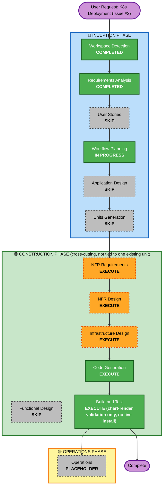

# Execution Plan — Kubernetes Deployment Support (GitHub Issue #2)

## Detailed Analysis Summary

### Change Impact Assessment
- **User-facing changes**: No — this is a deployment/infrastructure concern; the application itself (UI, API behavior, business logic) is unchanged.
- **Structural changes**: Yes, but additive — a new Helm chart and cluster-prerequisite setup material are introduced; no existing unit's code, API contract, or data model changes.
- **Data model changes**: No.
- **API changes**: No.
- **NFR impact**: Yes — new deployment-time NFRs (portability, secret hygiene, replica-safety constraints, resource discipline) as captured in `k8s-deployment-requirements.md`.

### Component Relationships (Brownfield)
- **Primary Components**: All 5 existing runtime services (`database`, `api-service`, `ingestion-worker`, `frontend`, `vector-db`) gain a second deployment path (Kubernetes, alongside the existing Docker Compose path — unchanged).
- **New Prerequisite Components**: External Secrets Operator + HashiCorp Vault (cluster-shared, installed once per cluster, outside this feature's Helm chart, not executed live this session per NFR-K8S-3).
- **Untouched**: `model-training/` (host-only, no container, explicitly out of scope); every unit's application code, business logic, and API contracts.

### Risk Assessment
- **Risk Level**: Medium-High — the surface is system-wide (touches every service's deployment definition at once) and introduces a real secrets-management architecture with a correctness-sensitive constraint (ingestion-worker must never run >1 replica). Execution risk itself is reduced by NFR-K8S-3 (no live changes to the user's real cluster this session) — verification is `helm lint`/`helm template`, not a real deploy.
- **Rollback Complexity**: Easy — purely additive new files (a new Helm chart + scripts); nothing existing is modified in a way that needs rolling back. `docker-compose.yml` stays the primary path.
- **Testing Complexity**: Moderate — no live cluster verification means testing is chart-rendering correctness (valid YAML, correct resource wiring, replica-safety constraints structurally enforced) rather than live behavioral testing.

## Workflow Visualization

## Phases to Execute

### 🔵 INCEPTION PHASE
- [x] Workspace Detection (COMPLETED)
- [x] Requirements Analysis (COMPLETED — `k8s-deployment-requirements.md`)
- [x] User Stories — **SKIP**
  - **Rationale**: Pure infrastructure/deployment change with no new user-facing functionality or workflow — matches this project's precedent (Categorization Model Fine-Tuning, ClearML/PyJWT Security Upgrade both skipped User Stories for the same reason).
- [x] Workflow Planning (IN PROGRESS — this document)
- [ ] Application Design — **SKIP**
  - **Rationale**: No new component, service, or method signature — this is deployment topology for existing services, not new business logic.
- [ ] Units Generation — **SKIP**
  - **Rationale**: Reuses the existing 5 services; no new unit of work. The Helm chart and prerequisite setup material are cross-cutting deployment artifacts, not a new application unit.

### 🟢 CONSTRUCTION PHASE
This feature doesn't map cleanly onto one of the existing per-unit directories (`database`/`api-service`/`ingestion-worker`/`frontend`) since it spans all of them at once. Its design/code-generation artifacts are tracked in a new feature-scoped location, `aidlc-docs/construction/k8s-deployment/`, rather than forced under a single unit's folder.

- [ ] Functional Design — **SKIP**
  - **Rationale**: No new data model or business rule.
- [ ] NFR Requirements — **EXECUTE**
  - **Rationale**: Real tech-stack/tooling decisions needed — Helm chart structure, HPA thresholds, resource request/limit sizing, probe strategy, ESO/Vault versions and chart sources.
- [ ] NFR Design — **EXECUTE**
  - **Rationale**: Concrete patterns needed for the replica-safety constraint (FR-K8S-3/NFR-K8S-5), the frontend↔api-service Ingress routing resolution (see Requirements' "Key Design Resolution"), and the Vault population script's design.
- [ ] Infrastructure Design — **EXECUTE**
  - **Rationale**: This feature *is* an infrastructure design exercise — chart layout, Ingress/TLS approach, PVC/StorageClass usage, ESO/Vault topology, all need to be mapped out concretely before Code Generation.
- [ ] Code Generation — **EXECUTE (ALWAYS)**
  - **Rationale**: Produces the actual Helm chart (`deploy/helm/transactagent/`), ESO/Vault prerequisite setup material (`deploy/helm/prerequisites/`), and the secret-population script (`deploy/scripts/populate-vault-secrets.sh`).
- [ ] Build and Test — **EXECUTE (ALWAYS, scope-limited)**
  - **Rationale**: Per NFR-K8S-3, nothing is installed on the user's real OrbStack cluster this session. Verification is `helm lint` + `helm template` (dry-run rendering) + manifest/schema sanity checks — real, not skipped, but bounded by the user's explicit choice not to have live changes made.

### 🟡 OPERATIONS PHASE
- [ ] Operations — **PLACEHOLDER** (actually applying this to the live cluster — ESO/Vault install, `helm install`, secret population — is the user's own follow-up action, not part of this feature's Build and Test)

## Success Criteria
- **Primary Goal**: A working, provider-agnostic Helm chart the user can `helm install` themselves against their OrbStack cluster (or any other cluster), plus the prerequisite ESO/Vault setup material and secret-population script, closing GitHub issue #2.
- **Key Deliverables**: `deploy/helm/transactagent/` chart, `deploy/helm/prerequisites/` (ESO + Vault values/instructions), `deploy/scripts/populate-vault-secrets.sh`, `aidlc-docs/construction/k8s-deployment/` design docs, `k8s-deployment-build-and-test-summary.md`.
- **Quality Gates**: `helm lint` clean; `helm template` renders valid YAML for default values; `ingestion-worker`/`database`/`vector-db` structurally incapable of running >1 replica regardless of values overrides; no secret material anywhere in the chart or git history; `docker-compose.yml` untouched and still functional.
