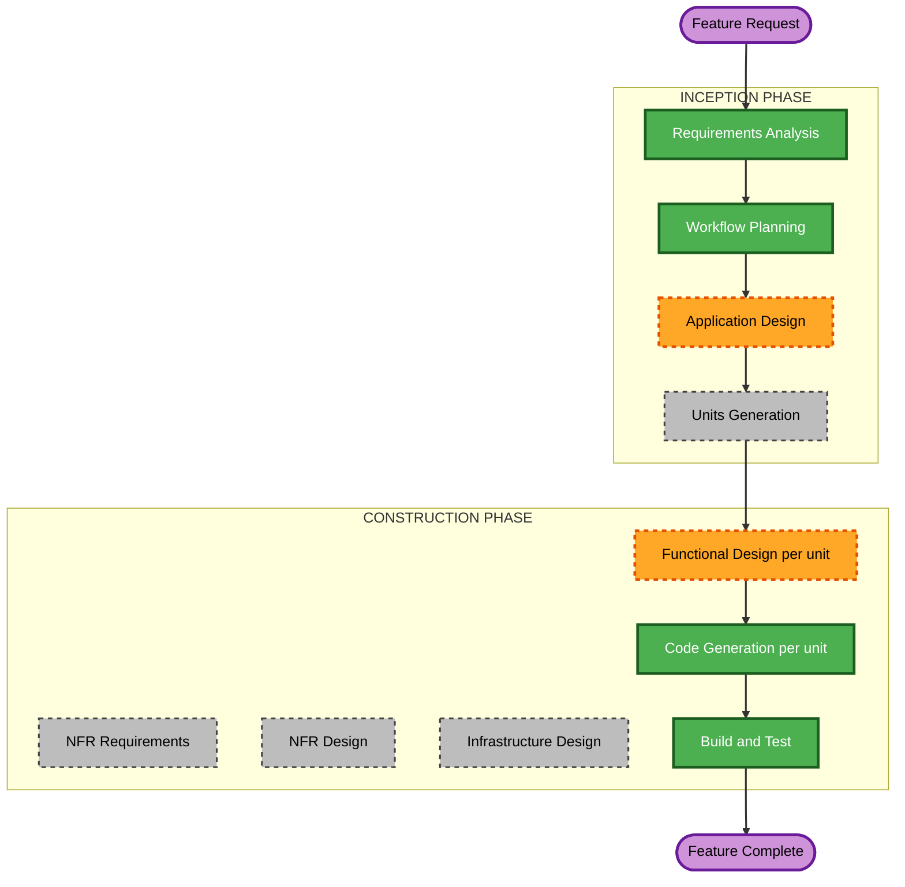

# Execution Plan — Matching Precision Refinement

Scoped to this feature only. The base project's own `execution-plan.md` and `aidlc-state.md` history are untouched; this plan governs the "Post-Completion Change" tracked separately in `aidlc-state.md`.

## Detailed Analysis Summary

### Transformation Scope (Brownfield)
- **Transformation Type**: Single-feature refinement within the existing architecture — no new container, no new external integration, no deployment-model change. Reuses the OpenAI-compatible LLM client, the Qdrant/embedding subsystem, and the Epic 6 `ProposalTable`/`ProposalRow` review pattern, all built already.
- **Primary Changes**: A behavior change to `ingestion-worker`'s categorization decision logic (always-on LLM classification, disagreement detection, score-boost matching, price-bucket embedding text); a new data shape to carry two candidate categories (Database); new/extended `api-service` endpoints to expose and resolve disagreement items; a `frontend` extension of the existing Review page for the choose-one-of-two action.
- **Related Components**: All 4 existing units are touched; no 5th unit is introduced.

### Change Impact Assessment
- **User-facing changes**: Yes — the Review page gains a new kind of reviewable item (category disagreement, choose-one-of-two), and categorization behavior changes (fewer silent `UNSURE`s where one signal was actually confident; some previously-auto-categorized-by-similarity-alone transactions now route to review if the LLM disagrees).
- **Structural changes**: No — no new container, no new inter-service coordination (still DB-only).
- **Data model changes**: Yes — a new way to carry two candidate categories per `matching-precision-refinement-requirements.md`'s "Deferred to Application/Functional Design" note (extend `RecategorizationProposal` vs. a new entity — resolved during Application Design below).
- **API changes**: Yes — new/extended endpoints to list and resolve disagreement items (likely folded into the existing recategorization/proposals API surface, exact shape resolved during Application Design).
- **NFR impact**: Minimal — no new performance/security/scalability category; reuses this project's existing tunable-settings, soft-dependency/graceful-degradation, and live-verification testing conventions (NFR-MPR-1..5).

### Component Relationships
- **Primary components**: `ingestion-worker` (categorization decision logic, embedding text, matching score), `database` (two-candidate data shape), `api-service` (expose/resolve disagreement items), `frontend` (Review page extension).
- **Dependency order**: `ingestion-worker` and `api-service` both read/write the new data shape but coordinate only through the database (same pattern as every prior feature) — both depend only on `database`. `frontend` depends only on `api-service`'s (extended) endpoints.
- **Supporting components**: None new.

### Risk Assessment
- **Risk Level**: Medium — changes the categorization decision made for every ingested transaction (real financial-categorization consequences), but every piece reuses established, already-proven infrastructure (LLM client, embedding/vector-store subsystem, Review page pattern) rather than introducing new architecture, and the disagreement case is explicitly designed to fail safe (routes to human review rather than silently picking wrong).
- **Rollback Complexity**: Moderate — the new data shape and Review-page extension are additive; the riskier part is the changed `categorize()` decision logic itself (existing categorization tests/assumptions need updating alongside it, not left stale).
- **Testing Complexity**: Moderate-High — `categorize()`'s new branching (agree / one-abstains-one-confident / genuine-disagreement / both-abstain) has several scenarios worth explicit coverage, plus the score-boost logic and the new Review-page choose-one-of-two flow, per NFR-MPR-5.

## Workflow Visualization



### Text Alternative
```
INCEPTION
- Requirements Analysis: COMPLETED
- User Stories: SKIPPED (approved by user — backend algorithm/matching refinement, no new user-facing workflow beyond the Review-page extension already captured directly in FR-MPR-10/11)
- Workflow Planning: IN PROGRESS (this document)
- Application Design: EXECUTE
- Units Generation: SKIP (existing 4 units already decomposed; this feature maps onto them, no new unit boundary needed)

CONSTRUCTION (per affected unit: Database, Ingestion Worker Service, API Service, Frontend SPA)
- Functional Design: EXECUTE (changed/new business logic, data shape, endpoints, and UI per unit)
- NFR Requirements: SKIP (no new NFR category; NFR-MPR-1..5 are thin enough to fold into Functional Design)
- NFR Design: SKIP (same reason)
- Infrastructure Design: SKIP (no new container, port, or deployment topology)
- Code Generation: EXECUTE (always)
- Build and Test: EXECUTE (always, after all affected units)
```

## Phases to Execute

### INCEPTION PHASE
- [x] Requirements Analysis (COMPLETED)
- [x] User Stories (SKIPPED — approved by user)
- [x] Workflow Planning (IN PROGRESS — this document)
- [ ] Application Design — **EXECUTE**
  - **Rationale**: Resolves the explicitly-deferred schema decision (extend `RecategorizationProposal` with a second candidate category vs. a new entity), defines the new/extended `api-service` endpoint(s) for listing and resolving disagreement items, and maps the `categorize()` decision-logic change plus the Review-page extension across components before per-unit Functional Design.
- [ ] Units Generation — **SKIP**
  - **Rationale**: The 4 units already exist and were decomposed during the original build. This feature changes behavior within those existing boundaries — no new unit, no re-decomposition needed.

### CONSTRUCTION PHASE (repeated per affected unit: Database, Ingestion Worker Service, API Service, Frontend SPA)
- [ ] Functional Design — **EXECUTE**
  - **Rationale**: New/changed data shape (Database), new categorization decision logic + embedding/matching changes (Ingestion Worker), new/extended endpoints and DTOs (API Service), Review-page choose-one-of-two UI (Frontend).
- [ ] NFR Requirements — **SKIP**
  - **Rationale**: No new performance, security, or scalability category introduced; NFR-MPR-1..5 in the requirements doc are already specific enough to carry straight into Functional Design without a dedicated stage — same precedent as the Recategorization Review Panel and the Similarity-Matching Normalization fix.
- [ ] NFR Design — **SKIP**
  - **Rationale**: Same as above — nothing to design against since NFR Requirements is skipped.
- [ ] Infrastructure Design — **SKIP**
  - **Rationale**: No new container, host port, or deployment topology change — everything lives inside the 4 existing services, reusing the already-provisioned `vector-db` service and the existing LLM endpoint config.
- [ ] Code Generation — **EXECUTE (ALWAYS)**
  - **Rationale**: Implementation is the point of this change.
- [ ] Build and Test — **EXECUTE (ALWAYS)**
  - **Rationale**: This project's established completion bar is live-container verification, not just unit tests (per `audit.md` precedent across every prior feature).

## Package Change Sequence

1. **Database** — land the new/extended data shape for two-candidate disagreement items. Must land first; both other backend units depend on it.
2. **Ingestion Worker Service** and **API Service** — can proceed in parallel once Database is ready. They coordinate only through the database (same DB-only pattern as today) — neither calls the other directly.
3. **Frontend SPA** — depends on API Service's new/extended endpoints being available; naturally last.

## Success Criteria
- **Primary Goal**: Ingestion classifies every transaction with the new local LLM, matching uses a price-aware, higher-threshold, LLM-signal-boosted embedding comparison, and a genuine categorization disagreement becomes a human-resolvable item on the existing Review page instead of a silent `UNSURE`.
- **Key Deliverables**: New/extended data shape + migration; updated `ingestion-worker` categorization/embedding/matching logic; new/extended `api-service` endpoints; extended `frontend` Review page; tests for every new decision branch.
- **Quality Gates**: All 4 units' existing test suites still pass; new tests cover FR-MPR-1..12's branches; full stack rebuilt and verified live (matching this project's established bar), consistent with `NFR-MPR-5`.
