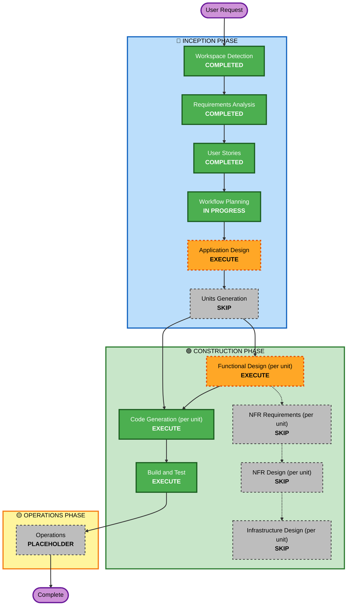

# Execution Plan — Nightly Transaction Backup

## Detailed Analysis Summary

### Transformation Scope (Brownfield)
- **Transformation Type**: Single-feature addition within the existing architecture — no new units, no deployment-model change.
- **Primary Changes**: New scheduled backup capability in the Ingestion Worker Service (CSV export, Drive upload, retention cleanup, catch-up logic); a new tracking entity in the Database; a new status endpoint in the API Service; a new "Backup Status" panel in the Frontend SPA's Review page.
- **Related Components**: `drive_client.py` (needs new upload/create-folder/list/delete-in-backup-folder capability, extending the existing pattern), `main.py`'s poll loop (needs a new backup check alongside the existing run/job checks), `ReviewPage.tsx` (needs a new panel alongside `ProposalTable`).

### Change Impact Assessment
- **User-facing changes**: Yes — new "Backup Status" panel on the Review page (US-7.4).
- **Structural changes**: No — fits within the existing 4-unit architecture (Database, API Service, Ingestion Worker Service, Frontend SPA); no new unit needed.
- **Data model changes**: Yes — new tracking entity (working name `BackupRun`) to persist backup history for catch-up (FR-8) and status display (FR-10/FR-11).
- **API changes**: Yes — new read endpoint(s) on API Service to expose backup status to the frontend.
- **NFR impact**: No new NFR category — reuses the existing retry/transient-error pattern (NFR-2), existing single-run-at-a-time worker invariant (NFR-1), existing tech stack (Python/FastAPI/SQLAlchemy/React). No new NFR Requirements/Design stage needed.

### Component Relationships
- **Primary Components**: Ingestion Worker Service (scheduling + Drive upload/retention), Database (new entity), API Service (status endpoint).
- **Secondary Component**: Frontend SPA (status panel — depends on the API Service endpoint).
- **Dependency chain**: Database's new entity must exist before Ingestion Worker Service can write backup-run records or API Service can read them; Frontend depends on API Service's endpoint.

### Risk Assessment
- **Risk Level**: Medium — introduces a new Drive write/delete capability (retention deletes files) where the existing code only ever reads; scoped narrowly (NFR-4, US-7.2 edge case) to mitigate.
- **Rollback Complexity**: Easy — additive feature, no changes to existing tables/endpoints/behavior; can be disabled by not scheduling the backup check.
- **Testing Complexity**: Moderate — retention/catch-up/no-retry timing rules need deliberate test scenarios (already captured as acceptance criteria in `nightly-backup-stories.md`), similar to Build and Test's approach for Epic 6.

## Workflow Visualization

## Phases to Execute

### 🔵 INCEPTION PHASE
- [x] Workspace Detection (COMPLETED)
- [x] Requirements Analysis (COMPLETED)
- [x] User Stories (COMPLETED)
- [x] Workflow Planning (IN PROGRESS — this document)
- [ ] Application Design — **EXECUTE**
  - **Rationale**: New component methods needed — a backup scheduler/orchestrator in the Ingestion Worker Service, new Drive client capabilities (create folder, upload, list-with-delete in a specific subfolder), and a new API Service component exposing backup status. These need explicit definition before per-unit Functional Design, matching how Epic 6 handled its new Recategorization Review component.
- [ ] Units Generation — **SKIP**
  - **Rationale**: All 4 existing units (Database, API Service, Ingestion Worker Service, Frontend SPA) already exist and are sufficient — this feature extends them, it doesn't need a new unit.

### 🟢 CONSTRUCTION PHASE (per affected unit: Database, Ingestion Worker Service, API Service, Frontend SPA)
- [ ] Functional Design — **EXECUTE**
  - **Rationale**: New data model (`BackupRun` tracking entity) and non-trivial business logic (retention window, catch-up detection, no-same-night-retry rule, Drive-failure vs generic-failure classification) need explicit design before coding, matching Epic 6's precedent.
- [ ] NFR Requirements — **SKIP**
  - **Rationale**: No new NFR category or tech-stack decision — reuses the project's existing Python/FastAPI/SQLAlchemy/React stack and the existing retry/transient-error pattern already selected for Drive calls.
- [ ] NFR Design — **SKIP**
  - **Rationale**: NFR Requirements skipped; nothing to design against.
- [ ] Infrastructure Design — **SKIP**
  - **Rationale**: No new infrastructure — runs inside the existing Ingestion Worker container on its existing poll loop; no new host ports, services, or deployment topology changes.
- [ ] Code Generation — **EXECUTE (ALWAYS)**
  - **Rationale**: Implementation required across all 4 affected units.

### Unit Sequence
Database (new `BackupRun` entity + migration) → {Ingestion Worker Service (scheduling/export/upload/retention), API Service (status endpoint)} → Frontend SPA (Backup Status panel on Review page)

Database must land first since both Ingestion Worker Service and API Service read/write the new entity. Ingestion Worker Service and API Service have no dependency on each other and could be done in either order; Frontend SPA is last since it depends on the API Service endpoint.

### 🟢 Build and Test
- [x] Build and Test — **EXECUTE (ALWAYS)**
  - **Rationale**: Full rebuild + live end-to-end verification, matching the completion bar established by every prior feature in this project (including a live-simulated backup cycle: forced schedule trigger, retention with >7 files, a forced Drive failure to verify the Review-page panel).

### 🟡 OPERATIONS PHASE
- [ ] Operations — PLACEHOLDER (deployment is the existing `docker-compose up`, no separate step)

## Success Criteria
- **Primary Goal**: Transactions are backed up nightly to a CSV in a dedicated Drive folder, with exactly 7 most recent backups retained, survives worker restarts, and failures are visible on the Review page.
- **Key Deliverables**: `BackupRun` entity + migration; extended `drive_client.py` (upload/create-folder/delete-scoped-to-backup-subfolder); backup scheduling integrated into the existing poll loop; new API status endpoint; new Backup Status panel on `ReviewPage.tsx`.
- **Quality Gates**: All new + existing unit tests passing; live end-to-end verification against the real Drive backup folder (per this project's established Build and Test bar).
