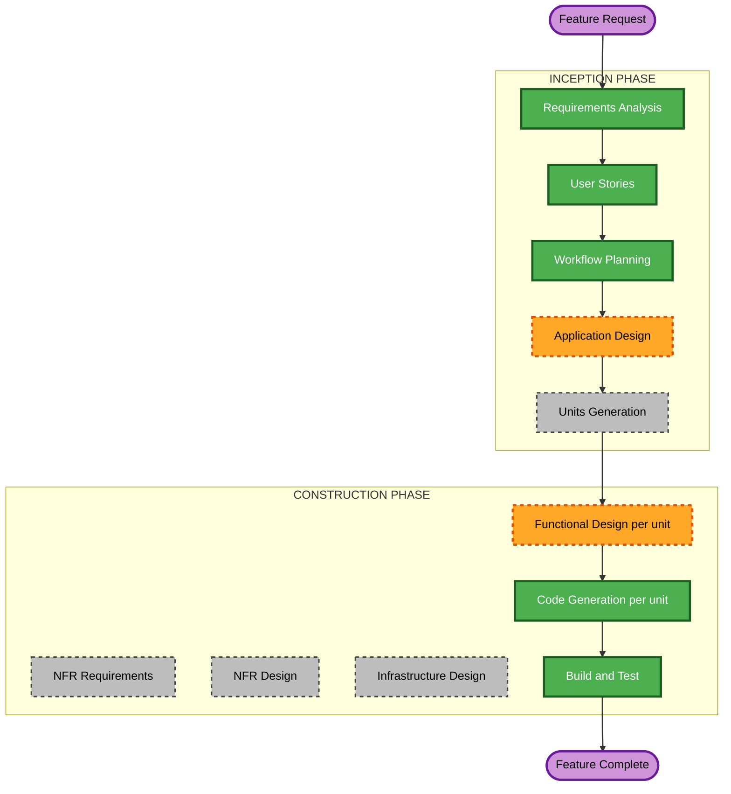

# Execution Plan — Probable Duplicate Statement Detection (Epic 14)

Scoped to this feature only. The base project's own `execution-plan.md`, `aidlc-state.md` history, and the in-flight Account Balance change (`account-balance-execution-plan.md`) are untouched; this plan governs the "Post-Completion Change" tracked separately in `aidlc-state.md`.

## Detailed Analysis Summary

### Transformation Scope (Brownfield)
- **Transformation Type**: Single-feature change within the existing architecture. No new container, no new external integration, no deployment-model change.
- **Primary Changes**:
  - **Database**: a new ingestion-file outcome for a skipped probable duplicate; remembered records of flagged, overridden, dismissed, and removed files (by content hash); the stored comparison snapshot; a statement-removal job. An additive migration.
  - **Ingestion Worker Service**: the duplicate detector (after extraction, before anything is created), the remembered-hash check (before extraction), the removal job in the poll loop (including deleting the transactions' embeddings, which needs a new per-point delete in the vector store client), and the Backfill Tool integration (dry-run listing, keeping the right copy, carrying manual corrections across).
  - **API Service**: endpoints for the duplicate-pair list and count, the comparison view, confirm-removal, dismiss, and the "ingest it anyway" override; threshold settings in the existing Settings catalog.
  - **Frontend SPA**: the "Probable duplicate statements" panel and badge on the Review page; the "probable duplicate of <statement>" link and comparison view in the Ingestion run results; the override action.
- **Related Components**: All 4 existing units are touched; no 5th unit is introduced. Model Training is not touched (a permanent delete of a duplicate's transactions affects its training data only in the way any deletion would, and the classifier is shelved).

### Change Impact Assessment
- **User-facing changes**: Yes. New outcomes and a comparison view in Ingestion results, a new Review-page panel and nav badge, a confirm-and-delete flow, and a changed backfill report.
- **Structural changes**: No. `api-service` and `ingestion-worker` still coordinate only through the shared database; removal is requested through a database row and executed by the worker, exactly because the API Service must never touch the vector store (NFR-PD-4).
- **Data model changes**: Yes. Additive: a new enum value on an existing column, plus new tables.
- **API changes**: Yes. New endpoints; no change to existing contracts.
- **NFR impact**: Moderate. Accuracy on real data (NFR-PD-1), no repeated Gemini cost (NFR-PD-2), safe deletion (NFR-PD-3), architecture rule (NFR-PD-4), and no silent loss in the backfill (NFR-PD-5) are specific enough to carry into Functional Design; no new security, scalability, or monitoring category.

### Component Relationships
- **Primary components**: `database`, `ingestion-worker` (pipeline, a new duplicate-detection component, the removal handler, the vector store client, the Backfill Tool), `api-service` (a new component for duplicate review, the Settings catalog), `frontend` (Review and Ingestion pages).
- **Dependency order**: `ingestion-worker` and `api-service` both read and write the new tables but never call each other; both depend only on `database`. `frontend` depends only on `api-service`.
- **Builds on the Account Balance change**: the Backfill Tool, the account-section tables, and the sections-based pipeline all come from Account Balance and exist today only as uncommitted work in the working tree on `feature/account-balance`.

| Component | Change Type | Reason | Priority |
|---|---|---|---|
| Database | Major (new outcome value + new tables) | Everything else depends on the new schema | Critical |
| Ingestion Worker Service | Major (detector, remembered hashes, removal job, backfill integration, vector delete) | Where detection and deletion actually happen | Critical |
| API Service | Major (new component + endpoints, settings) | User-facing decisions | Critical |
| Frontend SPA | Major (panel, badge, comparison view, override) | User-facing surface | Important |
| Model Training | None | Not affected by code | Optional |

### Risk Assessment
- **Risk Level**: High. A wrong "skip" drops a statement the user has today (especially inside the backfill's reingest); a wrong "delete" loses manual corrections that cannot be regenerated; and the detector must be accurate on small statements and across different spellings of a bank name.
- **Rollback Complexity**: Moderate for the additive parts (tables, endpoints, UI). Difficult for a confirmed removal, which is permanent by the user's choice (Q5 = A); NFR-PD-3 makes the confirmation state exactly what will be lost, and the removed file stays in Drive.
- **Testing Complexity**: Complex. The matching rule needs property-based tests on its pure parts; accuracy has to be demonstrated on the real data (NFR-PD-1); removal touches many tables plus the vector store; and the backfill integration changes an already-tested flow.
- **Key mitigations built into the plan**:
  - **Accuracy is a gate, not a hope**: Build and Test first runs the detector **read-only** against the live statements and requires the NFR-PD-1 result (both June pairs flagged, the CIMB look-alikes not, nothing else without review) before the feature is enabled.
  - **Recoverable false positives**: every skip stores its comparison and can be overridden (US-14.3); the backfill reports every skip.
  - **A switch**: Functional Design will give the detector an on/off setting alongside its thresholds on the existing Settings page, so it can be disabled without a redeploy if it misbehaves.
  - **No deployment and no run against live data in construction**: redeploying, running the read-only evaluation, and any real removal happen only at Build and Test or later, each with the user's explicit go-ahead.

## Workflow Visualization



### Text Alternative
```
INCEPTION
- Requirements Analysis: COMPLETED
- User Stories: COMPLETED
- Workflow Planning: IN PROGRESS (this document)
- Application Design: EXECUTE
- Units Generation: SKIP (existing 4 units already decomposed; this feature maps onto them)

CONSTRUCTION (per affected unit: Database, Ingestion Worker Service, API Service, Frontend SPA)
- Functional Design: EXECUTE (new data model, matching rule and calibration, removal job, endpoints, UI)
- NFR Requirements: SKIP (NFR-PD-1..8 are specific enough to carry straight into Functional Design)
- NFR Design: SKIP (follows NFR Requirements)
- Infrastructure Design: SKIP (no new container, port, or topology)
- Code Generation: EXECUTE (always)
- Build and Test: EXECUTE (always, after all 4 units)
```

## Phases to Execute

### INCEPTION PHASE
- [x] Requirements Analysis (COMPLETED)
- [x] User Stories (COMPLETED)
- [x] Workflow Planning (IN PROGRESS: this document)
- [ ] Application Design: **EXECUTE**
  - **Rationale**: New components and cross-unit contracts need explicit definition before per-unit Functional Design: the duplicate detector and the removal handler in the Ingestion Worker (plus a new branch in its poll loop and a per-point delete in the vector store client); a Duplicate Review component in the API Service; the Review panel, badge, and comparison view in the Frontend; and the data contract between them (remembered records, comparison snapshot, removal job).
- [ ] Units Generation: **SKIP**
  - **Rationale**: The 4 units already exist; this feature adds behavior inside those boundaries.

### CONSTRUCTION PHASE (repeated per affected unit: Database, Ingestion Worker Service, API Service, Frontend SPA)
- [ ] Functional Design: **EXECUTE**
  - **Rationale**: New data model (Database); the matching rule, its calibration against the live data, the remembered-hash flow, the removal job, and the backfill integration (Ingestion Worker); DTOs and endpoints (API Service); panel and comparison-view structure (Frontend). This is also where the open items from the requirements are resolved: the tolerance algorithm and period-overlap definition, where the snapshot and remembered records live, the removal job's status reporting, how the backfill orders copies and carries corrections, and the settings.
- [ ] NFR Requirements: **SKIP**
  - **Rationale**: NFR-PD-1..8 are already specific and testable in the requirements document; no new technology selection is needed.
- [ ] NFR Design: **SKIP**
  - **Rationale**: Follows NFR Requirements being skipped.
- [ ] Infrastructure Design: **SKIP**
  - **Rationale**: No new container, host port, or deployment topology; the removal job is one more branch in the worker's existing poll loop.
- [ ] Code Generation: **EXECUTE (ALWAYS)**
  - **Rationale**: Implementation is the point of this change.
- [ ] Build and Test: **EXECUTE (ALWAYS)**
  - **Rationale**: This project's completion bar is live-container verification. Here it begins with the **read-only accuracy evaluation on the real statements** (NFR-PD-1), and any removal of the real duplicates is a separate, explicitly confirmed step.

### OPERATIONS PHASE
- [ ] Operations: PLACEHOLDER
  - **Rationale**: Future deployment and monitoring workflows.

## Package Change Sequence

1. **Database**: the additive migration (new outcome value, remembered records, snapshot, removal job). Lands first; both backend units depend on it.
2. **Ingestion Worker Service** and **API Service**: in parallel once Database is ready. They coordinate only through the new tables.
3. **Frontend SPA**: depends on the API Service's new endpoints; naturally last.
4. **Accuracy gate, then enable**: after all four units are built and deployed, run the read-only evaluation against the live statements (NFR-PD-1) and enable the detector only if it passes.
5. **Resolve the existing pairs**: either through the Review-page panel (US-14.5/14.6) or by the Account Balance backfill (US-14.7), whichever happens first.

## Sequencing With the Account Balance Change (stated, not assumed)

- **The one hard constraint** (FR-PD-18, Q7 = A): this feature must be in place **before the Account Balance backfill is run**. It does not need to be finished before the rest of Account Balance's construction.
- **They share code**: this feature modifies `ingestion-worker/.../orchestrator/pipeline.py`, `embedding/vector_store.py`, `clients/drive_client.py`, `database/.../models.py` and its tests, and the Backfill Tool, all of which currently exist only as **uncommitted** Account Balance work on the local branch `feature/account-balance`.
- **Recommended order**: finish this feature's four units now (the user's stated priority, and the backfill depends on it), then return to the Account Balance API Service and Frontend, then one combined Build and Test and the two-stage go-live (evaluate, then backfill). The alternative, finishing Account Balance's remaining units first, is equally valid; nothing technical forces either.
- **Delivery decision for the user (not made here)**: because the two features touch the same files, they can only be delivered as **two separate pull requests** if Account Balance's work is committed first and this feature branched from that commit. No commit has been made and none will be without the user's instruction; otherwise both features land together in one pull request.
- **Migrations**: Account Balance owns `0019`; this feature's migration will be `0020` and depends on `0019`'s tables (for example the account-section rows a removal must delete).

## Success Criteria
- **Primary Goal**: A statement that is the same as one already held, saved as a different file, is skipped with a stated reason and a comparison the user can inspect; duplicates already in the data can be reviewed and removed safely; and the Account Balance backfill resolves them without losing manual corrections.
- **Key Deliverables**: Additive migration; the detector and remembered-hash check; the removal job with vector deletion; the Review-page panel, badge, and comparison view; the override; threshold and on/off settings; Backfill Tool integration.
- **Quality Gates**:
  - All 4 units' existing test suites still pass; new tests cover US-14.1 to US-14.7's acceptance criteria.
  - Property-based tests on the pure matching and snapshot-selection functions (NFR-PD-7).
  - **NFR-PD-1 accuracy evaluation on the real statements passes before the feature is enabled.**
  - Full stack rebuilt and verified live, matching this project's established bar.
  - No real removal and no backfill run without the user's explicit confirmation.
