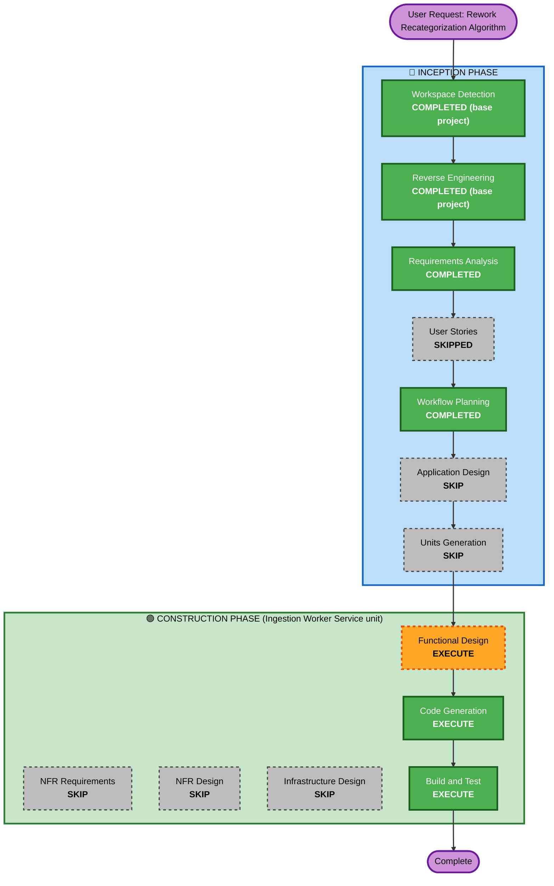

# Execution Plan — Recategorization Algorithm Rework

## Detailed Analysis Summary

### Transformation Scope (Brownfield)
- **Transformation Type**: Single component (Ingestion Worker Service) — no architectural transformation, no new service, no deployment-model change.
- **Primary Changes**: (1) Redesign `recategorize_unsure_from_precedent`'s matching strategy — broader precedent pool (LLM verification gate deferred, see below). (2) Rework the shared `build_embedding_text` to add an in-flow/out-flow signal and strip reference-code/ID noise, applied globally across its 3 consumers.
- **Related Components**: Categorization Engine (owns both the re-scan and `categorize()`), Embedding Manager (owns `build_embedding_text` and the storage-time batch job), Recurring Payment Manager (a dependent consumer of the shared embedding-text function, not itself being redesigned).
- **Deferred (not in this pass)**: Independent LLM verification gate (originally FR-RAR-2) — the user, after reviewing the plan, chose to focus this rework purely on embedding/matching accuracy and explicitly excluded LLM involvement in recategorization "for now." Kept documented in the requirements as a future enhancement.

### Change Impact Assessment
- **User-facing changes**: No — the Review page's approve/reject/auto-apply workflow is unchanged; only proposal quality improves.
- **Structural changes**: No new component/service; internal algorithm structure changes within 2 existing modules (`categorization/service.py`, `embedding/text.py`).
- **Data model changes**: No new schema/table. `NFR-RAR-3` (requirements doc) flags a real open question — whether existing vector-store embeddings need a backfill given the text-format change — to be resolved at Functional Design, not a schema change either way.
- **API changes**: None.
- **NFR impact**: Yes — NFR-RAR-3's stale-stored-vector risk still applies: existing vector-store embeddings predate the text-format change (direction signal + ID-stripping) and won't reflect it until backfilled, a decision Functional Design must make explicitly. (The earlier LLM-latency/reliability concern, NFR-RAR-1, no longer applies — the LLM gate is deferred, so the re-scan stays LLM-free as originally designed, WR-5.)

### Component Relationships
- **Primary Component**: Ingestion Worker Service — Categorization Engine (`recategorize_unsure_from_precedent`)
- **Shared Components**: Embedding Manager's `build_embedding_text` (query-time, used by Categorization Engine + Recurring Payment Manager; storage-time, used by the async embedding batch job)
- **Dependent Components**: Recurring Payment Manager (inherits the embedding-text format change as a side effect; its own matching algorithm is not being redesigned)
- **Supporting Components**: None new — same LLM endpoint, same vector store, same database

| Component | Change Type | Change Reason | Priority |
|---|---|---|---|
| Categorization Engine (re-scan) | Major | Core algorithm redesign (FR-RAR-1, FR-RAR-2, FR-RAR-3) | Critical |
| Embedding Manager (`build_embedding_text`) | Minor | Add direction signal (FR-RAR-6), used by 3 consumers | Critical |
| Categorization Engine (`categorize()`) | Configuration-only | Inherits new embedding text format only — no algorithm change | Important |
| Recurring Payment Manager | Configuration-only | Inherits new embedding text format only — no algorithm change | Important |
| Config (`.env`/`config.py`) | Minor | Reconcile threshold divergence (FR-RAR-5) | Important |

### Risk Assessment
- **Risk Level**: Low-Medium (revised down from Medium — the LLM-gate deferral removes the largest risk factor, a new dependency on this project's local LLM server, which had a real multi-hour hang earlier today). Remaining risk: broader blast radius than prior recategorization changes (touches a shared function with 3 consumers, not one isolated function) and operates on live production data (6000+ real transactions).
- **Rollback Complexity**: Moderate — code-only rollback is easy (git revert), but if a vector-store backfill is deemed necessary (NFR-RAR-3), that data-side change is not trivially reversible; Functional Design must account for this before Code Generation.
- **Testing Complexity**: Moderate — needs live verification against real DB (this project's established practice), specifically re-testing the exact PayNow-boilerplate false-positive cases already identified as evidence in the requirements document.

## Workflow Visualization

## Phases to Execute

### 🔵 INCEPTION PHASE
- [x] Workspace Detection (COMPLETED — base project)
- [x] Reverse Engineering (COMPLETED — base project artifacts reused)
- [x] Requirements Analysis (COMPLETED — 2 rounds, 9 questions total)
- [x] User Stories (SKIPPED — see `recategorization-algorithm-rework-user-stories-assessment.md`)
- [x] Workflow Planning (this document)
- [ ] Application Design — **SKIP**
  - **Rationale**: No new component or service. Both changed functions live inside existing Categorization Engine / Embedding Manager component boundaries already documented in `application-design/`. Matches precedent (`Recategorization Scope Narrowing` also skipped Application Design for identical reasoning).
- [ ] Units Generation — **SKIP**
  - **Rationale**: Entirely confined to the existing Ingestion Worker Service unit — no new unit, no decomposition needed.

### 🟢 CONSTRUCTION PHASE (single unit: Ingestion Worker Service)
- [ ] Functional Design — **EXECUTE**
  - **Rationale**: Substantial new business logic needs explicit definition before coding: the broader-precedent-pool retrieval strategy (FR-RAR-1), the exact ID-stripping heuristic for the embedding text (FR-RAR-7), the reworked threshold calibration (FR-RAR-3/5), and — critically — the NFR-RAR-3 backfill decision (accept temporary vector mismatch vs. build a backfill mechanism), which materially affects Code Generation scope.
- [ ] NFR Requirements — **SKIP**
  - **Rationale**: No new tech stack, no new infrastructure. The two NFR concerns this change actually has (latency/cost, data-consistency risk) are already captured directly in the requirements document (NFR-RAR-1, NFR-RAR-3) and will be resolved as part of Functional Design rather than a separate NFR stage — matches precedent set by every prior recategorization-related change in this project.
- [ ] NFR Design — **SKIP**
  - **Rationale**: Follows from NFR Requirements being skipped.
- [ ] Infrastructure Design — **SKIP**
  - **Rationale**: Same LLM endpoint, same vector store (Qdrant), same database — no infrastructure changes.
- [ ] Code Generation — **EXECUTE (ALWAYS)**
  - **Rationale**: Implementation of the redesigned re-scan, the embedding-text change, and (if Functional Design decides it's needed) a backfill mechanism.
- [ ] Build and Test — **EXECUTE (ALWAYS)**
  - **Rationale**: Live verification against the real DB, specifically re-testing the PayNow-boilerplate false-positive cases identified as evidence during Requirements Analysis, following this project's established live-verification practice.

### 🟡 OPERATIONS PHASE
- [ ] Operations — PLACEHOLDER (unchanged)

## Package Change Sequence
Single package (`ingestion-worker`) — no cross-package sequencing needed. Within it: `embedding/text.py` (FR-RAR-6) should land before `categorization/service.py`'s re-scan changes (FR-RAR-1/2/3), since the re-scan's new broader-pool search should search against the *new* embedding format, not the old one — sequencing detail for Code Generation planning, noted here for continuity.

## Estimated Timeline
- **Total Phases Executing**: 3 (Functional Design, Code Generation, Build and Test)
- **Estimated Duration**: Single working session — comparable in scope to `Matching Precision Refinement`, somewhat larger due to the shared embedding-text function touching 3 consumers.

## Success Criteria
- **Primary Goal**: The re-scan stops surfacing false-positive proposals for boilerplate-similar-but-unrelated transactions (the exact PayNow cases in the requirements evidence), while still catching genuine matches.
- **Key Deliverables**: Redesigned `recategorize_unsure_from_precedent` (broader pool + LLM gate), reworked `build_embedding_text` (direction signal), reconciled threshold config, resolved backfill decision.
- **Quality Gates**: All existing Ingestion Worker Service unit tests passing + new tests for the redesigned matching logic; live re-verification against the specific rejected-proposal examples found in evidence gathering; `docker compose build ingestion-worker` clean.
- **Integration Testing**: Confirm `categorize()` and Recurring Payment Manager still behave correctly after inheriting the new embedding-text format (no algorithm change expected there, but the input format to their existing logic does change).
