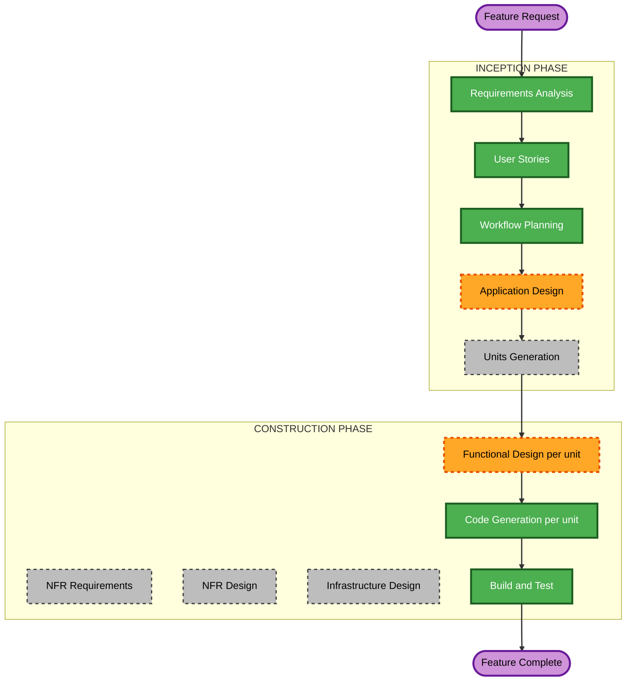

# Execution Plan — Recategorization Review Panel

Scoped to this feature only. The base project's own `execution-plan.md` and `aidlc-state.md` history are untouched; this plan governs the "Post-Completion Change" tracked separately in `aidlc-state.md`.

## Detailed Analysis Summary

### Transformation Scope (Brownfield)
- **Transformation Type**: Single-feature change within the existing architecture — no new container, no new external integration, no deployment-model change.
- **Primary Changes**: A new database entity (proposal records), a behavior change in `ingestion-worker`'s recategorization sweep (auto-apply/always-review split, broadened candidate search), new `api-service` endpoints (list/approve/reject proposals), and a new `frontend` page + nav badge.
- **Related Components**: All 4 existing units are touched; no 5th unit is introduced.

### Change Impact Assessment
- **User-facing changes**: Yes — new "Review" page, nav badge, and a behavior change to what happens after a manual category correction.
- **Structural changes**: No — no new container, no change to how `api-service` and `ingestion-worker` coordinate (still DB-only, per NFR-RR-1).
- **Data model changes**: Yes — a new table (proposal records), child of the existing `recategorization_jobs` row per correction event.
- **API changes**: Yes — new endpoints under a `api-service` router (list pending, approve, reject, bulk variants).
- **NFR impact**: Minimal — reuses this project's existing similarity-matching, testing, and DB-coordination patterns; no new performance/security/scalability category is introduced beyond what's already stated in `recategorization-review-requirements.md` (NFR-RR-1..4).

### Component Relationships
- **Primary components**: `database` (new table), `ingestion-worker` (sweep logic), `api-service` (new endpoints), `frontend` (new page).
- **Dependency order**: `ingestion-worker` and `api-service` both read/write the new table but never call each other directly (same DB-only coordination as today) — both depend only on `database`. `frontend` depends only on `api-service`'s new endpoints.
- **Supporting components**: None new — no new monitoring/logging beyond what each unit already has.

### Risk Assessment
- **Risk Level**: Medium — touches all 4 units and changes an existing automatic-write code path, but every piece reuses established patterns (DB-only coordination, existing similarity matcher, existing test bar) rather than introducing new architecture.
- **Rollback Complexity**: Moderate — an added table and new endpoints are additive and low-risk to roll back; the riskier part is the *behavior* change to the existing sweep (today's tests/assumptions around immediate auto-apply-to-UNSURE need updating alongside it, not left stale).
- **Testing Complexity**: Moderate — the two-tier auto-apply/review split (US-6.2/US-6.3) has several branching scenarios worth explicit test coverage, per NFR-RR-4.

## Workflow Visualization



### Text Alternative
```
INCEPTION
- Requirements Analysis: COMPLETED
- User Stories: COMPLETED
- Workflow Planning: IN PROGRESS (this document)
- Application Design: EXECUTE
- Units Generation: SKIP (existing 4 units already decomposed; this feature maps onto them, no new unit boundary needed)

CONSTRUCTION (per affected unit: Database, Ingestion Worker Service, API Service, Frontend SPA)
- Functional Design: EXECUTE (new data model + new business rules per unit)
- NFR Requirements: SKIP (no new NFR category; NFR-RR-1..4 are thin enough to fold into Functional Design)
- NFR Design: SKIP (same reason)
- Infrastructure Design: SKIP (no new container, port, or deployment topology)
- Code Generation: EXECUTE (always)
- Build and Test: EXECUTE (always, after all 4 units)
```

## Phases to Execute

### INCEPTION PHASE
- [x] Requirements Analysis (COMPLETED)
- [x] User Stories (COMPLETED)
- [x] Workflow Planning (IN PROGRESS — this document)
- [ ] Application Design — **EXECUTE**
  - **Rationale**: New service-layer methods across 3 units (broadened search, auto-apply/review split in `ingestion-worker`; approve/reject/list endpoints in `api-service`; page composition in `frontend`), plus a new data model and cross-component dependencies (all 3 depend on the new table) that need explicit definition before per-unit Functional Design.
- [ ] Units Generation — **SKIP**
  - **Rationale**: The 4 units already exist and were decomposed during the original build. This feature adds behavior within those existing boundaries — no new unit, no re-decomposition needed.

### CONSTRUCTION PHASE (repeated per affected unit: Database, Ingestion Worker Service, API Service, Frontend SPA)
- [ ] Functional Design — **EXECUTE**
  - **Rationale**: New data model (Database), new business logic (the two-tier split, broadened search — Ingestion Worker), new endpoints/DTOs (API Service), new page/component structure (Frontend).
- [ ] NFR Requirements — **SKIP**
  - **Rationale**: No new performance, security, or scalability category introduced; NFR-RR-1..4 in the requirements doc are already specific enough to carry straight into Functional Design without a dedicated stage.
- [ ] NFR Design — **SKIP**
  - **Rationale**: Same as above — nothing to design against since NFR Requirements is skipped.
- [ ] Infrastructure Design — **SKIP**
  - **Rationale**: No new container, host port, or deployment topology change — everything lives inside the 4 existing services.
- [ ] Code Generation — **EXECUTE (ALWAYS)**
  - **Rationale**: Implementation is the point of this change.
- [ ] Build and Test — **EXECUTE (ALWAYS)**
  - **Rationale**: This project's established completion bar is live-container verification, not just unit tests (per `audit.md` precedent across every prior feature).

## Package Change Sequence

1. **Database** — add the new proposal-record table (child of `recategorization_jobs`). Must land first; both other backend units depend on it.
2. **Ingestion Worker Service** and **API Service** — can proceed in parallel once Database is ready. They coordinate only through the new table (same DB-only pattern as today, per NFR-RR-1) — neither calls the other directly.
3. **Frontend SPA** — depends on API Service's new endpoints being available; naturally last.

## Success Criteria
- **Primary Goal**: A manual category correction routes proposals through review by default, auto-applying only the clearest `UNSURE`-bucket matches, with a working bulk-approve/reject Review page.
- **Key Deliverables**: New table + migration; updated `ingestion-worker` sweep logic; new `api-service` endpoints; new `frontend` Review page + nav badge; tests for the two-tier split.
- **Quality Gates**: All 4 units' existing test suites still pass; new tests cover US-6.1–US-6.6's acceptance criteria; full stack rebuilt and verified live (matching this project's established bar), consistent with `NFR-RR-4`.
