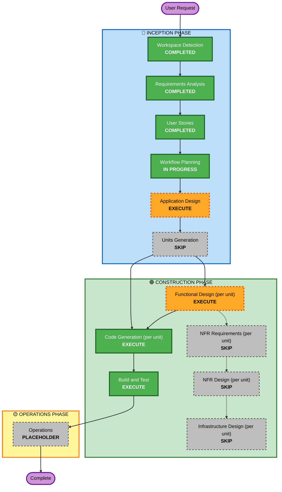

# Execution Plan — Recurring Payments, Budget Alerts & Subscription Detection

## Detailed Analysis Summary

### Transformation Scope
- **Type**: Single-feature addition within the existing architecture — no new units, no deployment-model change.
- **Primary Changes**: New Recurring Payment register + matching/trust workflow + detection heuristic in the Ingestion Worker Service; new tracking entities in the Database; new CRUD/status endpoints in the API Service; a new Dashboard section in the Frontend SPA.
- **Related Components**: Categorization Engine's existing similarity matcher (reused, not duplicated, per NFR-1); the Ingestion Orchestrator's poll loop (gains matching/detection work, similar to how Epic 7 added a third branch); Dashboard page (gains a new section).

### Change Impact Assessment
- **User-facing changes**: Yes — new Dashboard section (US-8.3), a new review workflow (US-8.4/8.5), bulk import (US-8.2), an attention-needed badge (US-8.7).
- **Structural changes**: No — fits within the existing 4-unit architecture.
- **Data model changes**: Yes — new entities: a Recurring Payment register, a match/proposal record per cycle (mirroring `RecategorizationProposal`'s shape), and detection-suggestion state (for sticky dismissal, US-8.6).
- **API changes**: Yes — new CRUD + bulk-import + match-review + status endpoints.
- **NFR impact**: No new NFR category — reuses the existing similarity-matching infra (NFR-1) and the existing no-direct-service-call rule (NFR-2). No new NFR Requirements/Design stage needed.

### Component Relationships
- **Primary Components**: Ingestion Worker Service (matching + trust logic + detection scan), Database (new entities), API Service (CRUD + review + status).
- **Secondary Component**: Frontend SPA (Dashboard section — depends on the API Service endpoints).
- **Dependency chain**: Database's new entities must exist before the Worker can write match records or the API can read/write the register; Frontend depends on the API endpoints.

### Risk Assessment
- **Risk Level**: Medium — introduces a genuinely new state machine (never-matched → pending-review → trusted → tolerance-gated-auto-apply) with real financial-tracking consequences if the tolerance gate is wrong; scoped narrowly (FR-7's explicit fallback-to-review-on-drift) to mitigate.
- **Rollback Complexity**: Easy — additive feature; also isolated on branch `feature/recurring-payments-budget-alerts`, so `main` is unaffected until merged.
- **Testing Complexity**: Moderate-to-high — the trust/tolerance state progression (US-8.5) needs deliberate scenario coverage, similar to Epic 6's auto-apply/review split.

## Workflow Visualization

## Phases to Execute

### 🔵 INCEPTION PHASE
- [x] Workspace Detection, Requirements Analysis, User Stories (COMPLETED)
- [ ] Application Design — **EXECUTE** — *Rationale*: new component methods needed (Recurring Payment Manager in the Worker, extended Categorization Engine reuse, new API component).
- [ ] Units Generation — **SKIP** — *Rationale*: the 4 existing units are sufficient.

### 🟢 CONSTRUCTION PHASE (per unit: Database → {Ingestion Worker Service, API Service} → Frontend SPA)
- [ ] Functional Design — **EXECUTE** — *Rationale*: new entities + a genuinely new state machine (trust/tolerance) need explicit design.
- [ ] NFR Requirements / NFR Design / Infrastructure Design — **SKIP** — *Rationale*: no new tech stack or infra topology; reuses the existing similarity-matching approach and worker poll loop.
- [ ] Code Generation — **EXECUTE (ALWAYS)**
- [ ] Build and Test — **EXECUTE (ALWAYS)**, including live verification against the real running stack, matching this project's established bar.

### 🟡 OPERATIONS PHASE
- [ ] Operations — PLACEHOLDER (deployment is the existing `docker-compose up`)

## Success Criteria
- **Primary Goal**: The Account Owner can load their real recurring-payments list, see due/overdue/set-aside status on the Dashboard, review proposed matches (with trusted payments graduating to tolerance-gated auto-apply), and get surfaced untracked recurring charges — all in-app.
- **Key Deliverables**: New DB entities + migration; matching/trust/detection logic in the Ingestion Worker; CRUD/import/review/status endpoints in the API Service; a new Dashboard section + attention badge in the Frontend.
- **Quality Gates**: All new + existing unit tests passing; live end-to-end verification (per this project's established Build and Test bar), using invented placeholder data only.
