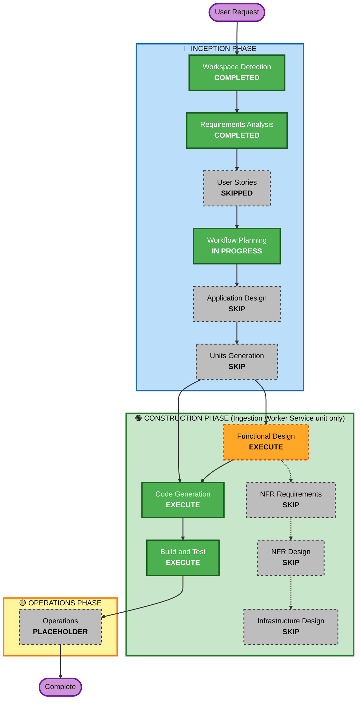

# Execution Plan — Similarity-Matching Normalization for Reference-Code Noise

## Detailed Analysis Summary

### Transformation Scope
- **Type**: Single-component accuracy fix within the existing architecture — no new units, no deployment-model
  change, no new component boundaries.
- **Primary Changes**: A new standalone normalization function in `ingestion-worker/src/ingestion_worker/categorization/similarity.py`,
  applied to both sides of every `find_best_match` text comparison, before `token_sort_ratio` scoring.
- **Related Components**: None beyond the Categorization Engine itself. `recurring_payments/service.py`'s
  unrelated `_normalize_description` is explicitly left untouched (FR-5). `amounts_in_range` (the AXS
  false-positive gate) is explicitly left untouched (NFR-2, Out of Scope).

### Change Impact Assessment
- **User-facing changes**: No — pure backend accuracy fix, no API/UI surface change.
- **Structural changes**: No — fits entirely within the existing Categorization Engine component.
- **Data model changes**: No.
- **API changes**: No.
- **NFR impact**: Minor — must stay a cheap, allocation-light pure-function operation (NFR-3), since it
  runs on every candidate comparison; no new tech stack or dependency.

### Component Relationships
- **Primary Component**: Ingestion Worker Service → Categorization Engine (`categorization/similarity.py`).
- **Call sites affected (indirectly, via `find_best_match`'s internals only)**: `categorization/service.py`'s
  `categorize` and `recategorize_unsure_from_precedent` — neither's own signature changes.
- **No dependency chain**: Database, API Service, and Frontend SPA are all untouched — single-unit change.

### Risk Assessment
- **Risk Level**: Low — isolated pure-function change to one file, well-understood diagnosis, concrete
  regression cases already identified (the 3 diagnosis examples plus the existing AXS PTE LTD test).
- **Rollback Complexity**: Easy — single-file change, additive normalization step; also isolated on branch
  `feature/recurring-payments-budget-alerts`, so `main` is unaffected until merged.
- **Testing Complexity**: Low — example-based tests against the 3 diagnosis examples + existing regression
  suite (including the AXS-style amount-gate test) + property-based tests per the project's existing Partial
  PBT convention for this module.

## Workflow Visualization

## Phases to Execute

### 🔵 INCEPTION PHASE
- [x] Workspace Detection, Requirements Analysis (COMPLETED)
- [x] User Stories — **SKIPPED** — *Rationale*: pure internal accuracy fix, no new user-facing feature or
  workflow, no new persona/acceptance-criteria need.
- [ ] Application Design — **SKIP** — *Rationale*: no new components or component methods; this modifies
  the internals of an existing function (`find_best_match`) without changing its signature or the
  Categorization Engine's component boundary.
- [ ] Units Generation — **SKIP** — *Rationale*: single existing unit affected (Ingestion Worker Service),
  no new data model, no new API surface, no unit decomposition needed.

### 🟢 CONSTRUCTION PHASE (Ingestion Worker Service unit only — Database, API Service, Frontend SPA untouched)
- [ ] Functional Design — **EXECUTE** — *Rationale*: the normalization pattern itself needs explicit design
  (regex/token-shape rules) and validation against the 3 diagnosis examples before implementation; also
  warrants a small business-rules addendum (existing WR-3 area) documenting the new normalization step.
- [ ] NFR Requirements / NFR Design / Infrastructure Design — **SKIP** — *Rationale*: no new tech stack,
  dependency, or infra topology; stays a pure Python stdlib string operation within the existing worker.
- [ ] Code Generation — **EXECUTE (ALWAYS)**
- [ ] Build and Test — **EXECUTE (ALWAYS)** — existing 460-test suite must pass unchanged, plus new
  example-based + property-based tests for the normalization function itself.

### 🟡 OPERATIONS PHASE
- [ ] Operations — PLACEHOLDER (deployment is the existing `docker-compose up`)

## Success Criteria
- **Primary Goal**: Repeat payments to the same PayNow (or other rail) payee stop failing similarity-based
  matching purely due to embedded per-transaction reference-code noise, without weakening the AXS-incident
  amount-gate protection.
- **Key Deliverables**: New normalization function in `similarity.py`; small business-rules addendum;
  updated/added tests in `test_similarity.py`.
- **Quality Gates**: All 3 diagnosis examples (as same-payee repeat-payment pairs) score ≥ `similarity_threshold`
  (85.0); full existing test suite (460 tests) continues to pass unchanged; AXS-style regression test
  continues to correctly reject a near-identical-text/very-different-amount pair.
